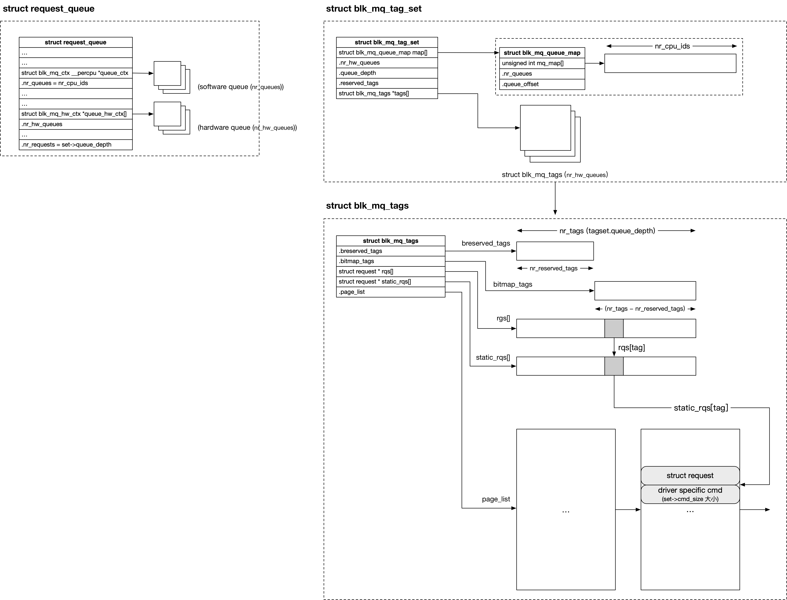

# tagset

tagset is an essencial struture of block layer. We will dive into the design of it in this article, and notice that I'll assume the low layer is nvme driver(this makes it convenient to tell the story). Any comments are welcome! Especially pointing out my errors since I'm a kernel newbie. :)

## Structure
Let's first have a overview of it.
(image from a blog: [LostJeffle](https://lostjeffle.bitcron.com/post/blog/mweb/docs/15873857063115#toc_4))


### tag
What is a tag? This is a question must be answered first. Multiqueue device like nvme ssd can handle multiple requests at the same time. When a nvme command(thus a block layer request(I'll just call it request below)) completes, we get a cqe. Then we definitely need to know which request this cqe belongs to due to the fact that there are multiple requests running. This is what a tag does.

### request
Well, I know you are still confused how a tag works. Let's first turn to request, this may help you understand all of this.
1. When is a request allocated? the time we issue a IO request?
The answer is no, we do it when probing the device. And yes, we allocate all of them at once. This is for efficiency.

2. How many requests do we need to init?
We should allocate queue_depth requests for each queue since there will be at most queue_depth requests running at the same time. And the edge case is the device fetches all the requests from a full queue.

3. Where do we store the requests?
In struct blk_mq_tags as you can see above. Every queue has a blk_mq_tags structure.
Let's jump into this structure:
```c
struct blk_mq_tags {
	unsigned int nr_tags;
	unsigned int nr_reserved_tags;
	atomic_t active_queues;
	struct sbitmap_queue bitmap_tags;
	struct sbitmap_queue breserved_tags;
	struct request **rqs;
	struct request **static_rqs;
	struct list_head page_list;
};
```
(I've removed some unrelated members)
* page_list points to pages that stores the requests.
* static_rqs is an array where each element is a request pointer. They point to requests in page_list in order. For example, static_rqs[i] points to (i+1)th request.
* rqs is an array indicates the used requests. Actually it looks all the same as the static_rqs.
* bitmap_tags
This is a bitmap with a same length as rqs/static_rqs. If request i is used, bitmap_tags[i] will be set.
* breserved_tags
The low nr_reserved_tags requests are for high priority usage. So don't use them if you think you really need to.

OK, now let's conclude what is a tag. generally speaking, a tag is actually an index of a request in the request array. And through a tag we can find the corresponding request easily.

## Initialization
Now let's see the init process of tagset. We've already know the last part of a nvme device initialization is nvme_dev_add() (nvme_reset_work()-->nvme_dev_add()). It basically initialize the tasgset structure.

1. nvme_dev_add()
    ```c
    static void nvme_dev_add(struct nvme_dev *dev)
    {
        if (!dev->ctrl.tagset) {
            dev->tagset.ops = &nvme_mq_ops;
            dev->tagset.nr_hw_queues = dev->online_queues - 1;
            dev->tagset.nr_maps = 2; /* default + read */
            if (dev->io_queues[HCTX_TYPE_POLL])
                dev->tagset.nr_maps++;
            dev->tagset.timeout = NVME_IO_TIMEOUT;
            dev->tagset.numa_node = dev->ctrl.numa_node;
            dev->tagset.queue_depth = min_t(unsigned int, dev->q_depth,
                            BLK_MQ_MAX_DEPTH) - 1;
            dev->tagset.cmd_size = sizeof(struct nvme_iod);
            dev->tagset.flags = BLK_MQ_F_SHOULD_MERGE;
            dev->tagset.driver_data = dev;

            ret = blk_mq_alloc_tag_set(&dev->tagset);
            dev->ctrl.tagset = &dev->tagset;
        }

        nvme_dbbuf_set(dev);
    }
    ```
    * ops is super important. I'll analyze it in a separate article.[blk_mq_ops](../block/blk_mq_ops)
    * nr_hw_queues: number of io queues(adminq not included)
    * nr_maps: queue types
    ```c
    enum hctx_type {
        HCTX_TYPE_DEFAULT,
        HCTX_TYPE_READ,
        HCTX_TYPE_POLL,

        HCTX_MAX_TYPES,
    }
    ```
    * numa_node: a device thus all its queues sticks to a numa node. This means all the memory needed by it is from this Node(like the queue memory)

    * queue_depth: depth of a queue, origin from the device capability(how many it can handle at the same time)

    * cmd_size: size of a command
    ```c
    struct nvme_iod {
        struct nvme_request req;
        struct nvme_command cmd;
        struct nvme_queue *nvmeq;
        bool use_sgl;
        int aborted;
        int npages;		/* In the PRP list. 0 means small pool in use */
        int nents;		/* Used in scatterlist */
        dma_addr_t first_dma;
        unsigned int dma_len;	/* length of single DMA segment mapping */
        dma_addr_t meta_dma;
        struct scatterlist *sg;
    };
    ```
    Ok, let's return to the page_list again. Each element in it is not just a request, but a combination of request and driver specific cmd. You can see it clearly in the picture.
    And for nvme, the driver specific cmd is struct nvme_iod.

    * driver_data: points to the device structure.

2. `int blk_mq_alloc_tag_set(struct blk_mq_tasg_set *set)`

    ```c
    int blk_mq_alloc_tag_set(struct blk_mq_tag_set *set)
    {
        if (blk_mq_alloc_tag_set_tags(set, set->nr_hw_queues) < 0)
            return -ENOMEM;

        ret = -ENOMEM;
        for (i = 0; i < set->nr_maps; i++) {
            set->map[i].mq_map = kcalloc_node(nr_cpu_ids,
                            sizeof(set->map[i].mq_map[0]),
                            GFP_KERNEL, set->numa_node);
            if (!set->map[i].mq_map)
                goto out_free_mq_map;
            set->map[i].nr_queues = is_kdump_kernel() ? 1 : set->nr_hw_queues;
        }

        ret = blk_mq_update_queue_map(set);
        if (ret)
            goto out_free_mq_map;

        ret = blk_mq_alloc_set_map_and_rqs(set);
        if (ret)
            goto out_free_mq_map;

        mutex_init(&set->tag_list_lock);
        INIT_LIST_HEAD(&set->tag_list);

        return 0;
    }
    ```

    Let's focus on the key part of it(the code above)

    * `blk_mq_alloc_tag_set_tags(set, set->nr_hw_queues)`
    Allocate struct blk_mq_tags for set->tags
    
    * set->map
    Ok, let's go to the next part: struct blk_mq_queue_map, we use this struct to record the mapping from each software queue to hardware queue.(about software/hardware queue, see [multi-queue model](./multiqueue.md))
        ```c
        for (i = 0; i < set->nr_maps; i++) {
            set->map[i].mq_map = kcalloc_node(nr_cpu_ids,
                            sizeof(set->map[i].mq_map[0]),
                            GFP_KERNEL, set->numa_node);
            if (!set->map[i].mq_map)
                goto out_free_mq_map;
            set->map[i].nr_queues = is_kdump_kernel() ? 1 : set->nr_hw_queues;
        }
        ```

        A tagset(struct blk_mq_tasg_set) has a member called map[HCTX_MAX_TYPES]. It is an array of struct blk_mq_queue_map
        ```c
        struct blk_mq_queue_map {
            unsigned int *mq_map;
            unsigned int nr_queues;
            unsigned int queue_offset;
        };
        ```
        * mq_map is an array of length nr_cpu_ids, each element in it means a mapping from software queue i to hardware queue mq_map[i]. and value mq_map[i] is in range [queue_offset, queue_offset+nr_queues)

        * nr_queues and queue_offset indicates the hardware queue id range of that queue type, that is [queue_offset, queue_offset+nr_queues)
        
        Let's pick up an example to make it clearer.
        Say there are 10 hardware IO queues, numbered [0, 9]
        and there are 2 types of these hardware queues.
        HCTX_TYPE_DEFAULT: [0, 7)
        HCTX_TYPE_POLL: [7, 10)
        And there are 12 CPUs in total. About the mapping algorithm, let's assume a naive linear one.
        Then the structure looks like:
        ```c
        blk_mq_tag_set {
            blk_mq_queue_map map[HCTX_MAX_TYPES] = {
                map[HCTX_TYPE_DEFAULT], ------------------> blk_mq_queue_map {
                                                                mq_map = [0, 1, 2, 3, 4, 5, 6, 0, 1, 2, 3, 4],
                                                                nr_queues = 7,
                                                                queue_offset = 0,
                                                            }
                // not used
                map[HCTX_TYPE_READ], ---------------------> blk_mq_queue_map {
                                                                mq_map = [0, 0, 0, 0, 0, 0, 0, 0, 0, 0, 0, 0],
                                                                nr_queues = 0,
                                                                queue_offset = 0,
                                                            }

                map[HCTX_TYPE_POLL], ---------------------> blk_mq_queue_map {
                                                                mq_map = [7, 8, 9, 7, 8, 9, 7, 8, 9, 7, 8, 9],
                                                                nr_queues = 3,
                                                                queue_offset = 7,
                                                            }
            }
        }
        ```
        very clear, right?
    </br>
    * `blk_mq_update_queue_map(set)`
    We allocated memory for all the mq_map array, now let's do the map work. The basic logic of this is to use
    set->ops->map_queues() to do driver specific mapping. but if that is not set up, blk_mq_map_queues() will be leveraged.
    Mapping software queues to hardware queues should be analyzed carefully and as deeply as possible since it is the essencial part of block layer.
    Thus I've put it here: [multiqueue model](./multiqueue.md)

    * `blk_mq_alloc_set_map_and_rqs(set)`
    It calls __blk_mq_alloc_rq_maps(set) and the latter calls __blk_mq_alloc_map_and_rqs(set, i) for each hardware queue.
    It does:
        ```c
    	    set->tags[hctx_idx] = blk_mq_alloc_map_and_rqs(set, hctx_idx, set->queue_depth);
        ```
        
        blk_mq_alloc_map_and_rqs:
        ```c
            struct blk_mq_tags *blk_mq_alloc_map_and_rqs(struct blk_mq_tag_set *set, unsigned int hctx_idx, unsigned int depth)
            {
                struct blk_mq_tags *tags;
                int ret;

                tags = blk_mq_alloc_rq_map(set, hctx_idx, depth, set->reserved_tags);
                ret = blk_mq_alloc_rqs(set, tags, hctx_idx, depth);
                return tags;
            }
        ```
        Seems this is a memory leak? I remember set->tags[] is allocated before..
        * blk_mq_alloc_rq_map(set, hctx_idx, nr_tags, reserved_tags)
        This one inits members in set->tag[hctx_idx] for hardware queue hctx_idx.
        Just notice one thing, **the memory for set->tag[hctx] and its ->rqs, ->static_rqs are from the numa node
        whoes CPUs are mapped to this hardware queue. And a hardware is bound some CPUs according to this queue's irq affinity.**
        **Let's sort out the logic, the device is bound to a numa node, and each hardware queue of it is bound to a numa node too(actually it's bound to some CPUs and those CPUs are in same node, hmm I'm not sure...). 'bound' means we will get memory from
        this node, so for device generic stuff, we allocate memory from the device bound node while for hardware queue specific stuff we allocate memory from queue bound node.** This design is to avoid remote memory access.

        * blk_mq_alloc_rqs(set, tags, hctx_idx, depth)
        This allocates memory for requests in a hardware queue. The allocated pages are linked in tags->page_list and tags->static_rqs[] are made to point to the position of the request.
        It then calls blk_mq_init_request(set, rq, hctx_idx, node) to init every request and mark rq->state to MQ_RQ_IDLE.
        blk_mq_init_request() calls set->ops->init_request() to do the real driver specific request initilization. For this, see [init_request()](./blk_mq_ops.md).

    


