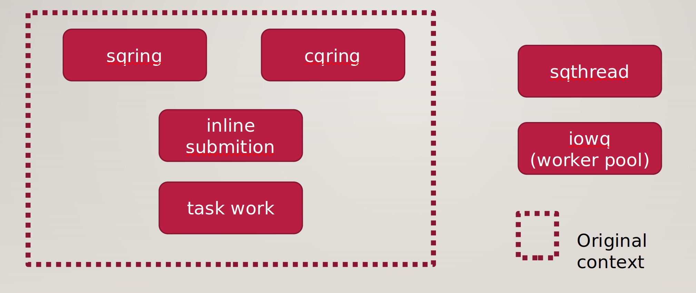
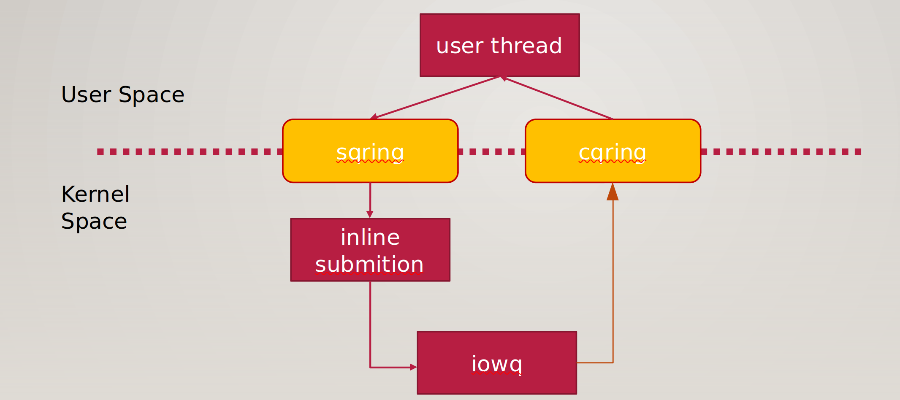

# uringlet

### 背景

io_uring是近几年崛起的异步IO框架，其性能大大优于传统的libaio，相比目前流行的用户态框架spdk则具有高度通用，对业务侵入性小的优势。这篇文章将对io_uring的结构作基本的介绍，并指出其存在的问题，最后由此提出解决方案uringlet。

### io_uring架构

下图是io_uring主要的组成构件。


（task work和sqthread不是本文的主题，可以略过）


- sqring和cqring

io_uring维护了两个ring buffer，一个用于提交IO请求，另一个用于收割IO请求。这两个内存区域是用户态和内核态共享的，因而当用户态批量提交IO请求时不需要每个请求都调用一次系统调用，而只需要调用一次io_uring_enter()。用户态和内核态的上下文切换开销大大减小。

- iowq

io_uring为了实现高性能的目标，实现了一套名为iowq的内核线程框架。相比Linux内核原有的内核线程机制，iowq的worker线程作为业务进程的内部线程存在，因而与业务进程共享内存地址空间、打开文件表等资源，这使得IO请求offload到iowq的时候上下文切换非常块，大大提升了异步化的效率。


### IO请求生命周期

下图表示了一个IO请求在io_uring中的生命周期。



io_uring从sqring中获得用户态下发的IO请求（用户态程序将IO请求打包成SQE（Submission Queue Entry）的形式），首先尝试在当前上下文提交该请求，如果一切顺利，那么在执行结束后将结果信息以一个CQE（Completion Queue Event）的形式放入cqring，以供用户态程序进行收割。
然而这是理想的情况，现实往往充满荆棘。上述提交往往会遇到阻塞的情况，比如内存不够用没法马上分配出来，或者需要获得的锁被其他进程获取了只能等待，又比如page cache中没有需要的数据，需要从磁盘加载等等等等。作为异步IO框架的io_uring显然要避免业务当前线程被阻塞，这是异步二字的应有之意。这时候就需要iowq登场了。我们以具体某处代码为例进行讲解，这样读者能够有更具象的认识。

```c
  static ssize_t ext4_dio_read_iter(struct kiocb *iocb, struct iov_iter *to)          
  {                                                                                
          ssize_t ret;                                                             
          struct inode *inode = file_inode(iocb->ki_filp);                         
                                                                                   
          if (iocb->ki_flags & IOCB_NOWAIT) {                                      
                  if (!inode_trylock_shared(inode))                                
                          return -EAGAIN;
          } else {                                                                 
                  inode_lock_shared(inode);                                        
          }
```

这段代码展示了ext4文件系统进行direct read操作的一段代码。我们可以发现当无法获取inode锁的情况下，ext4会向上返回EAGAIN错误。前提是IO控制块带有IOCB_NOWAIT标志。
io_uring在上述提交IO请求开始就会让IO控制块带上该标志，这样遇到上述阻塞时io_uring层会得到ext4层返回的EAGAIN错误。io_uring感知到下层即将发生阻塞，于是它创建/唤醒一个iowq的线程，将该IO请求托付给该线程从头开始提交（注意，这次提交将不会带有IOCB_NOWAIT, 因而是一次普通的同步IO过程），而原上下文则转去提交其他请求或者回到用户态（当请求都提交完毕的情况下）。iowq的内核线程执行完上述IO请求之后便会生成对应的CQE放入cqring以便用户态程序进行收割。
当然，这是简化之后的模型，真实的生命周期要更复杂一些，这会在以后的文章中进行说明。无论如何，上述简短的文字已经描绘出了完整的谷骨骼框架。

### 存在的问题

##### 问题一

让我们将注意力重新放到上述ext4代码。我们发现在这个if else结构中两个branch所做的操作完全不同，两者调用了不同的加锁函数。是的，如果要支持在即将阻塞的时刻返回而非阻塞，需要对代码进行如上改造。就buffered write（缓存写）操作而言，我们需要人工找出整个代码路径上的所有阻塞点并改造，比如：锁竞争，内存分配，文件系统日志操作，文件系统元数据访问与加载，通用块层资源分配等等。这样的代码点数之不尽，分布在Linux内核的各个角落，并且随着代码的增加而增加。这对io_uring的发展造成了很大的困扰，每当io_uring需要支持某个系统调用，就需要做一遍上述工作。而且这样的工作还需要得到对应子系统Maintainer的认可才能进入主线代码，这是一个非常漫长的过程。

##### 问题二

除了这个问题，让我们聚焦到IO请求的生命周期本身。我们可以发现，当一个IO请求遭遇阻塞时其实已经经过了它的代码路径的一部分，即从请求开始提交到阻塞点这一段。而当该IO请求被offload到iowq线程之后，是从头开始执行的。好，话分两头，我们再来看遭遇阻塞时的原线程，此时原线程向上返回EAGAIN错误到io_uring层，之后它才能意识到状况开始提交其它IO请求。
总结一下就是：
- IO请求从开始到阻塞点的“努力执行”被浪费了
- 原上下文需要将上述“努力执行”造成的影响消除（EAGAIN向上返回的过程）

这一来一回就造成了一定的overhead。
### 探索解决方案

那么怎么解决这个问题呢？我们可以发现关键的问题是如何有效利用IO请求阻塞前的代码执行。一个很自然的想法是当原线程即将阻塞时，将当前上下文（寄存器和栈）传递给创建/唤醒的iowq线程，而原线程则返回到io_uring层去提交其它请求。
这个方案听起来很美好，但是现实是残酷的，实际细想会发现这个方案实现起来面临很多问题：
- iowq线程的唤醒问题
  通常，一个线程被阻塞时的代码如下：
  ```c
  add task to wait list
  schedule()
  delete task from wait list
  ```
  上述代码表示task即将因某种资源没得到满足而阻塞，在调用`schedule()`之前它需要把自己加到对应该资源的等待队列中，后续该资源条件得到满足时由释放资源的线程通过访问该等待队列唤醒task。
  在Linux中，一个线程由`task_struct`结构表示，假设原线程的`task_struct`结构为taskA，创建/唤醒的iowq线程为taskB。上述代码中被加入wait list的是taskA，那么当我们在`schedule()`中将阻塞的上下文传递给taskB之后，谁来唤醒taskB呢？须知被唤醒的只能是taskA。

- 原线程返回问题
  另一个问题是原线程如何返回？能否直接跳转到提交其它IO请求的地方去？能否继续往下执行使其自然返回？
  答案是这两种都不太行。来看下面一段代码：
  ```c
  function alloc_memory() {
        if (no memory)
                schedule();
        return memory;
  }

  function foo() {
        m = alloc_memory(); // (1)
        ...
        ...
        n = alloc_memory(); // (2)
        ...
        ...
        n[x] = 1; // (3)
        ...
        free(m);
        free(n);
  }
  ```

  让我们假设（1）处分配内存成功，而（2）处分配失败导致阻塞。那么在（2）处的`schedule()`中我们通过对栈和寄存器信息进行乾坤大挪移进而使得原线程返回到提交其它IO请求处执行会产生什么后果，答案是内存泄漏。因为（1）处申请的内存没有被释放。通过这个简单的例子我们可以发现简单的跳转
  是徒劳的，因为从提交IO请求到阻塞点的代码执行过程中，我们可能已经修改了系统的状态，包括堆、栈、寄存器甚至外部设备。如果要实现这个方案，必须将系统的状态彻底rollback到刚开始提交该IO时。这个难度是很大的。
  那么能否让原线程继续往下执行从而自然而然地返回呢，很不幸，这样也是不太可行的。让我们关注下代码中（3）处，由于我们在（2）处分配内存失败，那么继续往下执行到（3），即对这片内存进行访问时显然会发生错误。综上，两种方案都不可行。

  这么看来，完美方案并不完美，因为难以实现。我们需要新的想法。
  
  有的同学可能会想第一个问题`iowq线程的唤醒问题`实际上是因为我们使用了新的`task_struct`来代表被阻塞线程导致的。
  既然如此，能不能仍然让taskA保持阻塞，而用新创建的taskB（外加一系列对taskB的上下文的展转腾挪）来提交其它IO并最终“作为原线程”返回到用户态呢。
  这是一个好的思路，因为它确实解决了上述两个问题。但是我们将面临几个新问题：
  - 怎样让taskA在完成IO请求之后不再返回到用户态，而是自行消亡
  - 怎样让taskB和taskA看起来一样，比如pid号，线程间相互关系等等。

  第一个问题比较好解决，我们只需在taskA阻塞时在合适的地方加上标记，然后在其完成IO并返回io_uring层时进行判断即可。
  第二个问题的解决方法如我在括号中所言，需要仔细传递taskA的信息到taskB，使得在用户态，taskB“看起来”和原来一样。当这里可能还隐藏了一个比较深的问题：正如线程睡眠前其`task_struct`结构会被加入到某个等待队列，有没有可能它也被加到其他地方过呢，这时候上是上述解决方案就失效了。可以参考下面的抽象例子来得到更好的理解：
  用户态函数foo()
  ```c
  syscall1(add task to some place X)
  do IO through io_uring // (1)
  syscall2(fetch task from X, and do something) // (2)
  ```
  
  因为我们在（1）处使用了新的taskB，所以在（2）处的代码将会发生错误，因为我们取到的仍然是taskA。

### uringlet

其实通过上述最后一种方案，我们应该已经对解决这个问题有点感觉了。“让taskA继续阻塞，让taskB提交其他IO”，那么能不能不用做上述复杂的hack操作来保证taskB看起来和taskA一样？当然是可以的，试想我们为什么要做这个操作呢，原因是taskB需要返回到用户态！因此需要让用户感觉不到返回的上下文有丝毫奇怪的变化（比如发现pid变了）。这么说来只要不让taskB返回用户态就行了，问题是我们终归需要一个上下文返回到用户态，否则怎么体现异步二字呢（原不能让用户被阻塞）。
为了实现这个目的，我们让原线程提交IO时什么都不做，而是直接返回。用一个iowq线程提交IO请求，当发生阻塞时，只需要创建/唤醒新的iowq线程用于提交其它IO，原iowq线程让其自然阻塞。这样，我们即没有阻塞原线程，也不需要做大量针对`struct task_struct`的hack操作了。两者的对比如下图：

```c

                  +----------------+                                              +----------------+  
                  |      taskA     |                                              |      taskA     | 
                  | (task_structA) |                                              | (task_structB) | 
                  +----------------+                                              +----------------+ 
user space                 |                                                        |            ^
---------------------------|--------------------------------------------------------|------------|-----------------        
kernel space               |         ========>   +------------------------+         |            |
                       submit IO                 |   taskB(iowq thread)   |         |            |
                           |                     |   (task_structA)       |         |      and return to userspace
                           V                     +------------------------+         |            |
                        blocked                              |             submit other IO       |
                                                         submit IO                  |            |
                                                             |                      |            |
                                                             V                      V----------->|
                                                          blocked                 
```
figure1


```c
                  +----------------+
                  |      taskA     |
                  |                |
                  +----------------+
user space            |         ^ 
----------------------|---------|---------------------------------------------------------------------------------------        
kernel space          |         |              +------------------------+       +------------------------+
                      |         |              |   taskB(iowq thread)   |       |   taskC(iowq thread)   |
                      |         |              |                        |       |                        |
                      V--------->              +------------------------+       +------------------------+
                     taskA just check                        |                              | 
                     if any CQE ready                        |                              |       
                                                         submit IO                    submit other IO   
                                                             |                              |           
                                                             V                              |           
                                                          blocked                           V            

```
figure2

由于我们让原线程（taskA）不再负责提交IO请求，而只让它在适当时候唤醒iowq线程做事情，因此原线程天然非阻塞了。我们不再需要做用`task_structB`替换`task_structA`并进行大量闪转腾挪上下文的操作。

这个最终的方案，我称之为uringlet。let有小切片的意思，这里用来指轻量级的执行单元，又因为用于io_uring，因而取此名。

### uringlet的不足


目前以发送该方案的RFC到io_uring社区进行迭代中。
