# PCIe
[toc]
PCIe is the latest serial bus protocol. 

## Fundamental
The PCIe bus is a point-to-point bus not shared like PCI, which means it can only connect with one endpoint(device). But it can connect to multiple endpoints though a switch. And with a PCIe Bridge, it can connect to PCI/PCI-X devices. A switch is like a bridge in PCI bus.
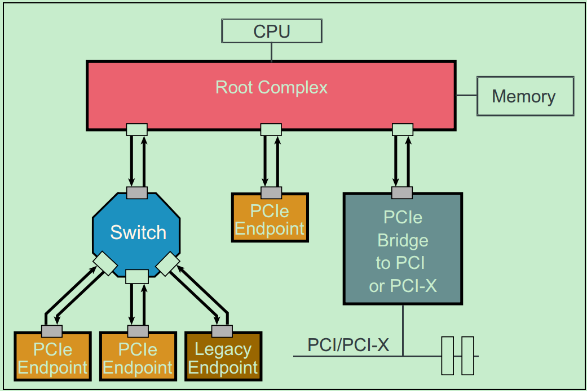

Legacy PCIe endpoint: designed to be PCI-X device but finally made to be PCIe device. may access by IO space.
Native PCIe endpoint:  only access by MMIO.

## Layers
There are three layers in PCIe protocol: application layer, transaction layer, data link layer and physical layer.
### physical layer
### data link layer
### transaction layer
4 types of requests:
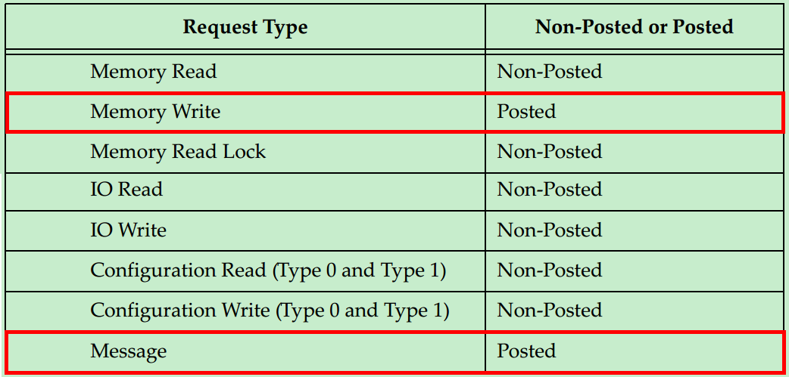

Posted: don't need a reply request containing the completion
Non-Posted: need the above reply
Posted type is for efficiency sensitive request like Memory Write. This doesn't mean the Completer won't answer in any cases. Sometimes it can reply with Ack/Nak (data link layer stuff)

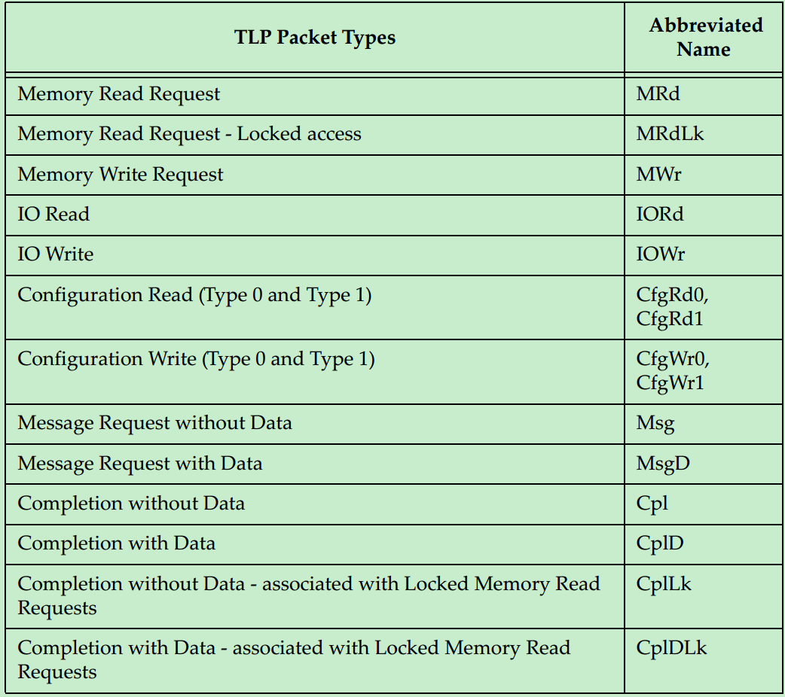

PCIe can connect legacy PCI devices, in this situation interruption from the legacy PCI devices will be translated to message request when it goes through PCIe bridge.

TLP transaction:
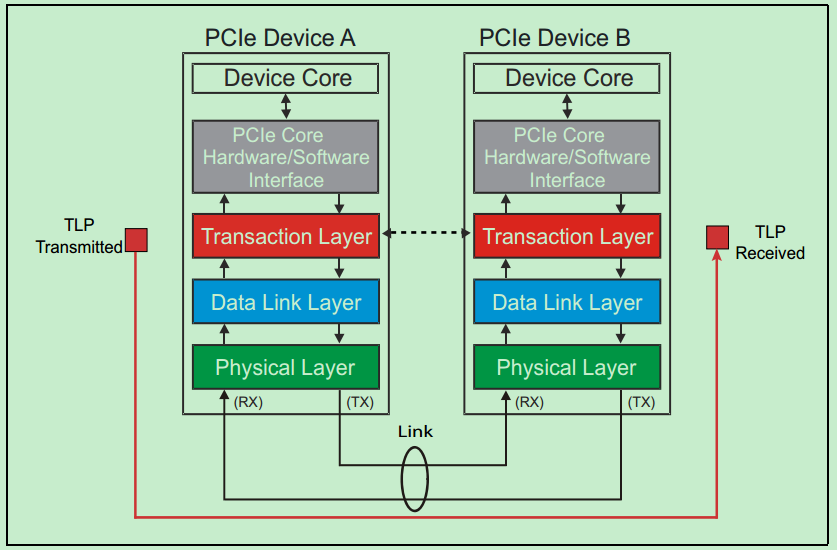

TLP in PCI package
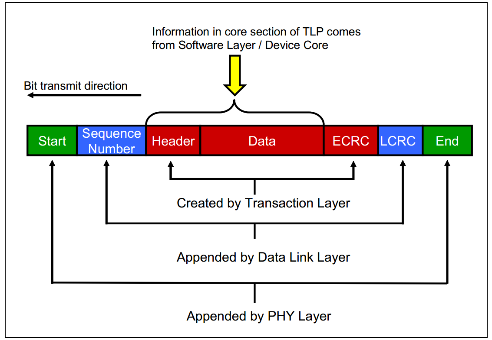

### application layer

## BDF
A PCIe device can have 1~8 Functions. every Function has a unique id which is called BDF(Bus, Device, Function), the application layer of the Root(usually it's your PC) is able to recognize the whole topological structure by BDF and other info in bridge's configuration space(Subordinate Bus Number, Secondary Bus Number, Primary Bus Number). This graph is an example:

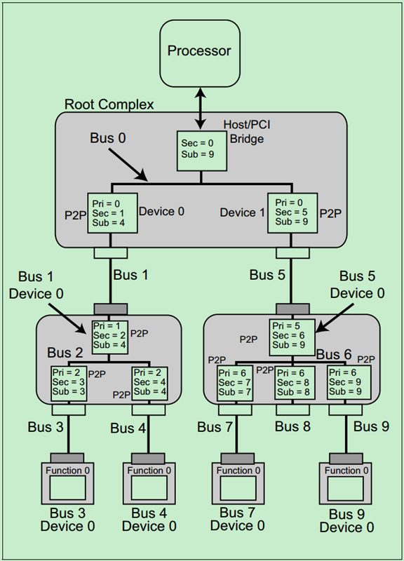

BDF is in a format of [Bus Number, Device Number, Function Number], and the size is 8bits, 5bits, 3bits. So PCIe supports 256 sub-buses, each sub-bus supports 32 devices, and each device support 8 functions.
PCIe use DFS to allocate BDF to each bus, device and P2P(PCI-to-PCI bridge) as you can see in the above img.

## Configuration Space
Each Function of a device has a independant configuration space. What is it exactly?
As we all know, PCI bus has a data/address line of 32 bits. So it can access 2^32^ = 4GB space. We map the configuration related registers in every PCI device to this address space. This forms the so called Configuration space.
A PCI device means the device meets the PCI protocol, in other words it has the PCI comman stuff, PCI configuration registers for instance.

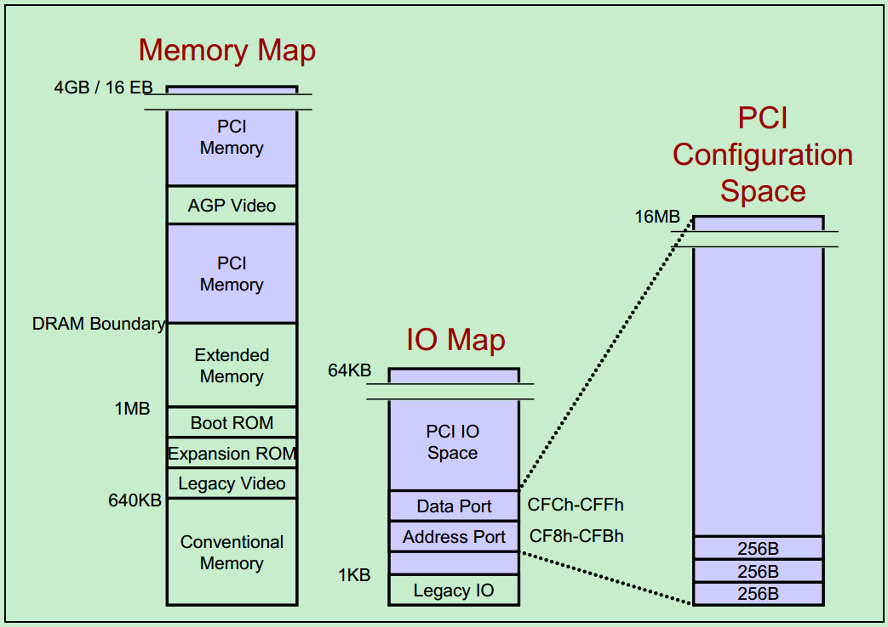

PCI CS(Configuration Space) can only be accessed via io space by cpu(IO-indirect Accesses). What does this mean? This means a cpu uses specific io instructions to access the io space, and there are (data port, address port) in io space which can be leveraged by the cpu to access the CS. Not sure my understanding of this is right, maybe it means we can map the CS to io spacce just like the above pic shows... x86 cpu only support 16 bits io space which means the PCI io address space is 64KB(min(2^32^, 2^16^))
Fortunately PCIe provides another way to access the CS which is called MMIO. MMIO means we can map the CS direct to the virtual memory address space.

For the size, PCI Function has 256 Bytes space in the CS while PCIe Function has 4KB. See below:

PCI CS:
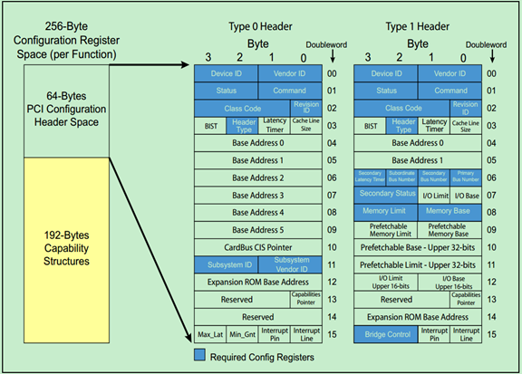

PCIe CS:

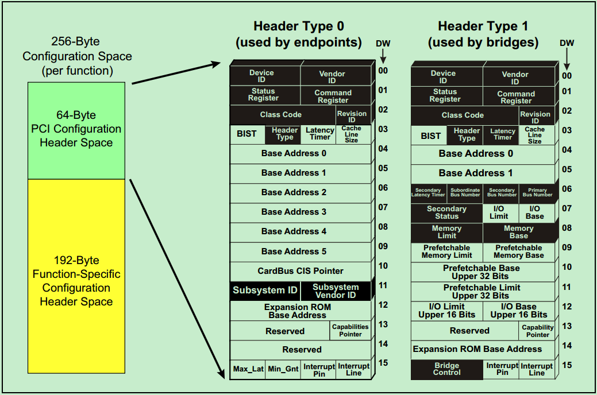

Type0 is for PCIe device while Type1 is for PCIe bridge

## Bar Space
BAR(Base Address Register) is essential for PCI/PCIe protocol. It points to a space where you can configure
the detail functionality of a PCI/PCIe device and thus it defines the device itself while the configuration space defines the generic PCIe functionality.
Let's pick up nvme device as an example, it uses two bar registers BAR0, BAR1 to represent a 64bit address(the picture below use BAR1 BAR2, nevermind, all the same)

To leverage a bar, you have to first write 1s to it to test how long the address segment is. then write the start address to it.(BAR pointed addresses are mapped to memory address spacce, this means cpu accesses them by MMIO)
BARs are initialized by the device driver once the device is detected by PCIe bus and matched with the right driver. For nvme, nvme_probe() does the work.

## INTx MSI MSIX
### INTx
INTx is the old way of triggerring interruption. It is based on sideband signal. And now it is called the legacy PCI interruption. Example:

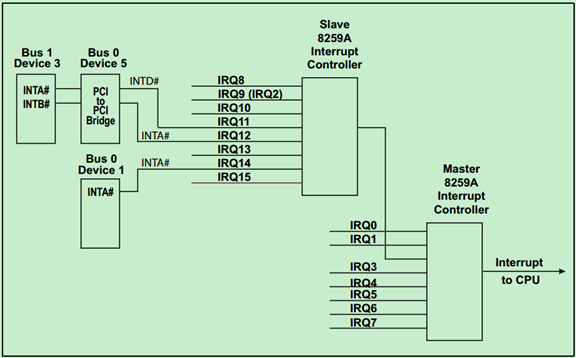

For more detial, see: http://blog.chinaaet.com/justlxy/p/5100057841

### MSI MSIX
#### general
To wipe out sideband signal, MSI and MSIX are proposed. MSI stands for Message Signaled Interruption.
Notice:
1. 'Message' here is not the Message request, MSI is actually through Posted Memory Write request.
2. in PCIe, INTx is translated to Message request.

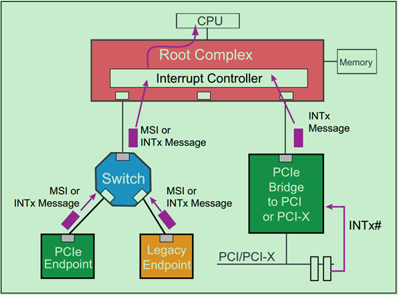

#### MSI Capability Structure
MSI related registers are in the configuration space(in the first 256 Bytes since its PCI compatible). MSI has four types(freely combine 32/64bit, w or w/o Per-Vector Masking)). The Per-Vector Masking is supported if Per-Vector Masking Capable bit in Message Control Register is 1.

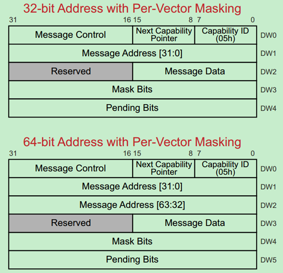

**Capability ID**: ID of this Capability Structure
**Next Capability Pointer**: link to the next Capability Structure. 00h means the end of the linked list.
**Message Control Register**:
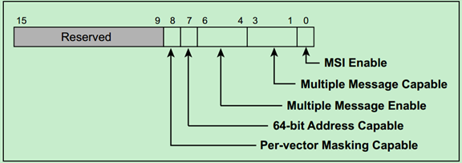

**Message Data**: the interruption vector id. Say a function has 8 interruptions, then Message Data[2:0] could be 3'b000~3'b111, in other words the interruption vector id must be contiguous.
**Mask Bits**: 1 means the corresponding interruption is masked. As you can see, the Mask bits are 32 bits, which means a device function can have 32 interruptions at most.
**Pending Bits**: when an interruption was triggered but masked, the corresponding pending bit will be set
and it will be cleared when the interruption is sent.

#### MSIX Capability Structure
MSI has 3 issues:
1. 32 interruption vectors are not enough.
2. the interruption vector id must be contiguous.
3. interruption priority chaos

MSIX support 2048 interruptions and it occupies less space in the configuration space since it stores the vector info in BAR space, And the BAR used is called BIR(BAR Index Register).

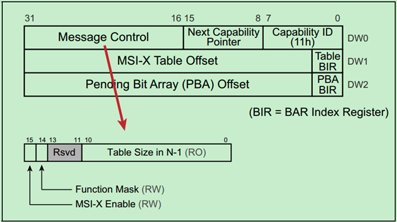

Say Table BIR is 2, then the vector table is in:

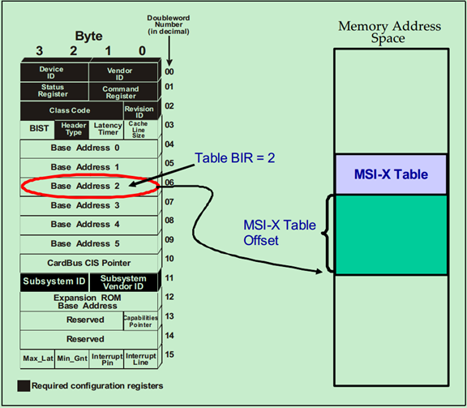

the vector table is like:

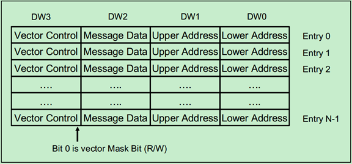

and Pending Bits are stored in the same way:

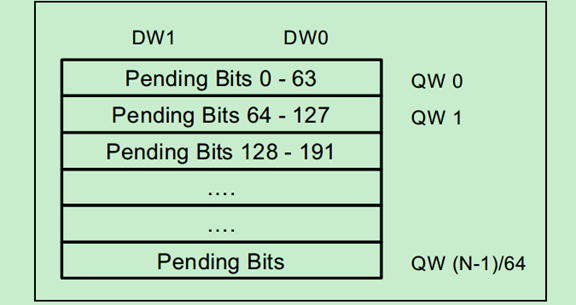
## TLP Routing
This part is not essential for me, I'll update it when it is necessary.
