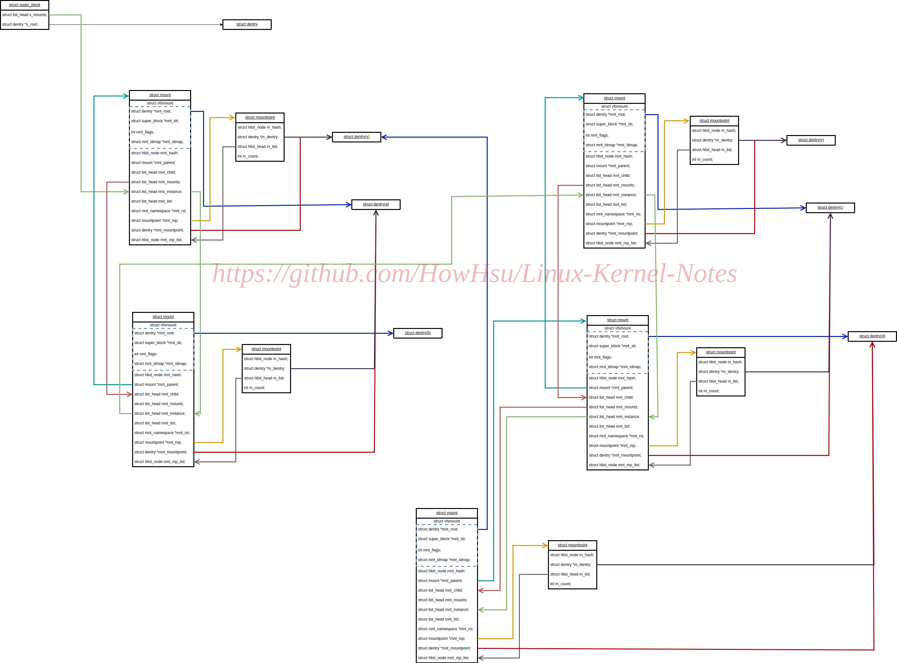

# Bind Mount

Mount syscall consists a bunch of functionalities. Bind Mount is important one
among them. This article takes you through the implementation of it.

## 1. What is bind mount

Usually you can mount a filesystem to another mounted filesystem. But bind mount
allows you to mount part of this mounted filesystem to another place. With eazier
words, it means you can mount a directory to another directory.(it allow mounting
a file to another file as well)
Maybe you now realise it sounds like "hardlink for directory". Yes, from my
perspective, it does implement "hardlink for directory" in linux. We already know
that hardlink for directory is forbidden in linux since that may cause **rings**
in fs directory tree, thus cause logic error like infinite loop.
But bind mount is safe since it normally doesn't recursively mount the sub mounts
of the source directory. Let's go through an instance to see it clearer.

```c
// There is a directory tree:
//	/ --> 'a' --> 'b'
// Now let's do a bind mount

mount --bind /a /a/b
```

**Think a problem: can we do something like `cd /a/b/b/b`?**
The answer is quite clear: It's impossible. When we execute the `mount` command,
we build a link from /a/b to /a, so we can do `cd /a/b/b`. Ok now we are at the
second 'b', recall what I said, "no recursive mount", this means this 'b' is a
normal directory. To be clearer, **logically we are not build a link from 'b' to
'a' but build a link to some new nodes.**

```c
// / --> 'a' --> 'b'(MOUNTED) [--> 'a' --> 'b']
```

## 2. Implementation

### 2.1 Simple part

Bind mount a part of mount syscall, the entrance is simple, just some generic
mount operations, like copying the userspace parameters, finding the dentry of
destination mount.

```c
// SYSCALL_DEFINE5(mount...) -> do_mount()

long do_mount(const char *dev_name, const char __user *dir_name,
		const char *type_page, unsigned long flags, void *data_page)
{
	struct path path;
	int ret;

	ret = user_path_at(AT_FDCWD, dir_name, LOOKUP_FOLLOW, &path);
	if (ret)
		return ret;
	ret = path_mount(dev_name, &path, type_page, flags, data_page);
	path_put(&path);
	return ret;
}
```

`user_path_at()` is to find the `dentry` and `parent mount` of the target directory.
(they are stored in `struct path`)
**Note: if a directory itself is a mountpoint, then the `parent mount` is the mount on itself**

Then we goes into `path_mount()`

### 2.2 `path_mount()`

```c
int path_mount(const char *dev_name, struct path *path,
		const char *type_page, unsigned long flags, void *data_page)
{
	...
	if (flags & MS_BIND)
		return do_loopback(path, dev_name, flags & MS_REC);
	...
}
```

### 2.3 `do_loopback()`

```c
static int do_loopback(struct path *path, const char *old_name,
				int recurse)
{
	struct path old_path;
	struct mount *mnt = NULL, *parent;
	struct mountpoint *mp;
	int err;
	if (!old_name || !*old_name)
		return -EINVAL;
	err = kern_path(old_name, LOOKUP_FOLLOW|LOOKUP_AUTOMOUNT, &old_path);
	if (err)
		return err;

	err = -EINVAL;
	if (mnt_ns_loop(old_path.dentry))
		goto out;

	mp = lock_mount(path);
	if (IS_ERR(mp)) {
		err = PTR_ERR(mp);
		goto out;
	}

	parent = real_mount(path->mnt);
	if (!check_mnt(parent))
		goto out2;

	mnt = __do_loopback(&old_path, recurse);
	if (IS_ERR(mnt)) {
		err = PTR_ERR(mnt);
		goto out2;
	}

	err = graft_tree(mnt, parent, mp);
	if (err) {
		lock_mount_hash();
		umount_tree(mnt, UMOUNT_SYNC);
		unlock_mount_hash();
	}
out2:
	unlock_mount(mp);
out:
	path_put(&old_path);
	return err;
}


```

It does:
- get the `struct path` of the source directory as `old_path`
(now you should remember the source is `old_path` and the target is `path`)


- `mnt_ns_loop(old_path.dentry)`: test if the source dentry is a nsfs dentry
	nsfs(namespace filesystem) [TBD]


- `mp = lock_mount(path);`
This is to find the 'last' dentry of target directory and mark it as a mountpoint,
then allocate a new `struct mountpoint` for it.
Here I think it needs some explanation. The source and the target directory can
both be mountpoint, for example:

```bash

mount --bind a x
mount --bind b x
mount --bind c y
mount --bind d y

mount --bind x y

```

Here what `lock_mount()` does is to find dentry of `d`, mark it with `DCACHE_MOUNTED`
and then return the newly allocated `struct mountpoint`.

More detail see: [lock_mount.md](./lock_mount.md)

- `parent = real_mount(path->mnt);`
Simple one, get the `struct mount` from its `struct vfsmount`, the latter is in the
former(not by pointer)


- `mnt = __do_loopback(&old_path, recurse);`
This basically create a new `struct mount` based on the parent mount of the source
directory.(let's assume recurse = false for now)
**Note: (pick up the above example) here the parent mount is not for `b` but for `a`,
because when we get the `old_path`, we don't traverse its mounts**
**Here remember it again, the source directory can be mountpoint too**

More detail see: [__do_loopback.md](./__do_loopback.md)


- `err = graft_tree(mnt, parent, mp);`
Ok, now we have a new mount, the parent mount of the target and a new mountpoint
structure.  Let's install the new mount to the right position in the mount tree.

More detail see: [graft_tree.md](./graft_tree.md)

## 3. relationship of key structures

```bash
mount --bind a x
mount --bind b x
mount --bind c y
mount --bind d y

mount --bind x y

```

Let's still leverage this case: Say there is a, b, c, d, x, y directories under '/'. And then we do the above mount for them.
How does it look? I've draw a picture to show the relationship
between `struct mount`, `struct mountpoint` and `struct dentry`.
For simplicity, I didn't add lines to link dentries, mount_hashtable and mountpoint_hashtable are ignored as well.



I know it's still hard to figure it out, believe me, I've tried my best to make it clear...

### 3.1 Question
To test if you are really clear about mount, think about this case:

```bash

mkdir /a /b /c /d /x /y
mkdir /b/b1 /b/b2
touch /a/in_a /b/b1/in_b1 /b/b2/in_b2 /c/in_c /d/in_d /x/in_x /y/in_y
mount --bind a x
mount --bind b x
mount --bind c y
mount --bind d y

mount --bind b/b1 b/b2
mount --bind x y

```

Now answer: What can you see when you run `tree` at "/"?
