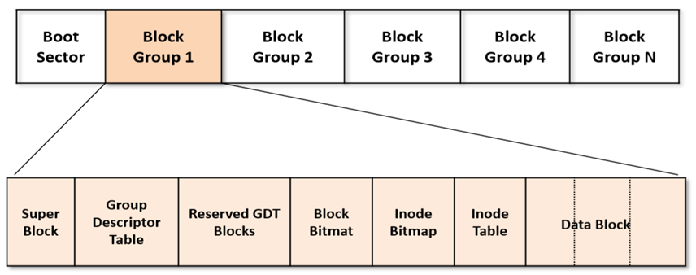
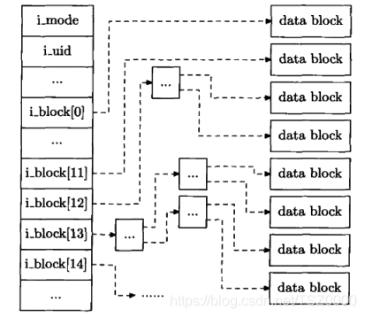

# dentry && inode

An essencial question about filesystem is: what happens when we open a file. To
figure it out, we have to first understand two concepts: dentry and inode. But
this article is not just about this two concepts, it aims to show the big picture
of filesystem from this two.

## ondisk data layout

Let's first go over the data layout of filesystem on the storage. Here I pick up
ext4 as an example.



ext4 divides the disk partition(a disk can be splited to several partitions, each one with a filesystem instance) to many block groups.(the boot sector only exists in the first partition if that disk is where the operation system installed).
Let's look into a block group briefly.
 * superblock contains info about the whole filesystem instance.
 * Group Descriptor Table contains info about this block group.
 * block bitmap indicates the state of each block in this group. Ok, one thing forgot to say, a group is divided to many blocks (that's why it is called block device).
 * inode bitmap is like block bitmap, it indicates which inode is in use
 which else is not.
 * inode table contains all the inodes in this group. An inode represents a
 file.
 * others are data blocks.

## inode

Here let's focus on inode, this is the key to a file. Below is the layout of ondisk
inode structure.

```c
struct ext4_inode {
	__le16	i_mode;		/* File mode */
	__le16	i_uid;		/* Low 16 bits of Owner Uid */
	__le32	i_size_lo;	/* Size in bytes */
	__le32	i_atime;	/* Access time */
	__le32	i_ctime;	/* Inode Change time */
	__le32	i_mtime;	/* Modification time */
	__le32	i_dtime;	/* Deletion Time */
	__le16	i_gid;		/* Low 16 bits of Group Id */
	__le16	i_links_count;	/* Links count */
	__le32	i_blocks_lo;	/* Blocks count */
	__le32	i_flags;	/* File flags */
	union {
		struct {
			__le32  l_i_version;
		} linux1;
		struct {
			__u32  h_i_translator;
		} hurd1;
		struct {
			__u32  m_i_reserved1;
		} masix1;
	} osd1;				/* OS dependent 1 */
	__le32	i_block[EXT4_N_BLOCKS];/* Pointers to blocks */
	__le32	i_generation;	/* File version (for NFS) */
	__le32	i_file_acl_lo;	/* File ACL */
	__le32	i_size_high;
	__le32	i_obso_faddr;	/* Obsoleted fragment address */
	union {
		struct {
			__le16	l_i_blocks_high; /* were l_i_reserved1 */
			__le16	l_i_file_acl_high;
			__le16	l_i_uid_high;	/* these 2 fields */
			__le16	l_i_gid_high;	/* were reserved2[0] */
			__le16	l_i_checksum_lo;/* crc32c(uuid+inum+inode) LE */
			__le16	l_i_reserved;
		} linux2;
		struct {
			__le16	h_i_reserved1;	/* Obsoleted fragment number/size which are removed in ext4 */
			__u16	h_i_mode_high;
			__u16	h_i_uid_high;
			__u16	h_i_gid_high;
			__u32	h_i_author;
		} hurd2;
		struct {
			__le16	h_i_reserved1;	/* Obsoleted fragment number/size which are removed in ext4 */
			__le16	m_i_file_acl_high;
			__u32	m_i_reserved2[2];
		} masix2;
	} osd2;				/* OS dependent 2 */
	__le16	i_extra_isize;
	__le16	i_checksum_hi;	/* crc32c(uuid+inum+inode) BE */
	__le32  i_ctime_extra;  /* extra Change time      (nsec << 2 | epoch) */
	__le32  i_mtime_extra;  /* extra Modification time(nsec << 2 | epoch) */
	__le32  i_atime_extra;  /* extra Access time      (nsec << 2 | epoch) */
	__le32  i_crtime;       /* File Creation time */
	__le32  i_crtime_extra; /* extra FileCreationtime (nsec << 2 | epoch) */
	__le32  i_version_hi;	/* high 32 bits for 64-bit version */
	__le32	i_projid;	/* Project ID */
}
```

It's well commented, one member we should focus on is `__le32	i_block[EXT4_N_BLOCKS];`
This array points to data blocks of this file.

But how? EXT4_N_BLOCKS is 15, say a block is 4KB, so a max size of a file is 15*4KB=60KB?
Surely no, in the legacy way, the first 12 items point to a block each, while the last 3
are indirect pointers. This means they point to blocks which contain pointers.



There is a little bit difference between the last 3 items(indirect pointers).
12nd can only have one layer of indirect block. 13th can have two layers as you can see in the picture. 14th can have three layers.
This significantly expand the size of file it supports. Let's do some simple
math, say a block is 4KB, then a block contains 4KB / 4B = 2^10 items. For
the i_block[14], there are 1\*2^10\*2^10\*2^10 = 2^30 blocks. So i_block[14] supports 2^30\*4KB = 4TB. Yes, ext4 supports a single file large as 4TB...in this way.
Just like what I said, the above is called the legacy way. Modern ext4 filesystem these days use a new way to index file blocks----extent.
Extent deserves a detail analysis in a seperate article.
[ext4 extent](./extent.md)

## direntry

In Linux, everything is file, so a directory is also a file, it has its own inode. The content of it are entries pointing to subdirectories and files, the entry is called direntry(directory entry), it contains file/directory name and their inode numbers.

```c
struct ext4_dir_entry_2 {
	__le32	inode;			/* Inode number */
	__le16	rec_len;		/* Directory entry length */
	__u8	name_len;		/* Name length */
	__u8	file_type;		/* See file type macros EXT4_FT_* below */
	char	name[EXT4_NAME_LEN];	/* File name */
};
```

And remember, the root directory inode number is always 2 in ext4.

## dentry

Ok, now that you know how we find all the data blocks of a file from its inode, let's walk through an example: A user is opening a file, what does he
have? A file path, yes, that's all he has. Say it is /a/b/c, how the operating system find
the file c?
We can first divide the path to several components: ['/', 'a', 'b', 'c']. Now let's go from
it:

(1) ['/', 'a', 'b', 'c']    the inode is 2, fetch data blocks of it, we get all the direntries of '/'
      ^

(2) ['/', 'a', 'b', 'c']    compare 'a' with direntries we got from (1), we find inode number of file 'a'
           ^

(3) ['/', 'a', 'b', 'c']    like (2), compare 'b' with direntries from inode a, we get inode b
                ^

(4) ['/', 'a', 'b', 'c']    same step like above, we finally get inode c
                     ^


Let's draw a simple graph to make it clearer.

   inode 2('/')
      |
      |
+------------+
| direntry 0 |
| direntry 1 |
| direntry 2 |
| .......... |
| direntry a | -----> inode a ----> +------------+
| .......... |                      | direntry 0 |
+------------+                      | direntry 1 |
                                    | direntry 2 |
                                    | .......... |
                                    | direntry b | ----> inode b ----> +------------+
                                    | .......... |                     | direntry 0 |
                                    +------------+                     | direntry 1 |
                                                                       | direntry 2 |
                                                                       | .......... |
                                                         inode c <---- | direntry c |
                                                                       | .......... |
                                                                       +------------+

All right, I know you'll ask question like "what if a user use a relative path?"
That's a good question, to support relative path, every directory file has two fixed
direntries----'.' and '..'. '.' means the current directory, while '..' means the
parent directory. From '..', we can easily get the inode number of the parent directory.

Does it look great? Totally not, because we have to access disk everytime we visit data
blocks to fetch direntries, that's a disaster in terms of efficiency.

So obviously Linux doesn't do it in this way. To make it faster, dentry is introduced.
dentry is something like direntry, you can see it as the memory version of direntry.
Yes, it only exist in memory.

```c
struct dentry {
	/* RCU lookup touched fields */
	unsigned int d_flags;		/* protected by d_lock */
	seqcount_spinlock_t d_seq;	/* per dentry seqlock */
	struct hlist_bl_node d_hash;	/* lookup hash list */
	struct dentry *d_parent;	/* parent directory */
	struct qstr d_name;
	struct inode *d_inode;		/* Where the name belongs to - NULL is
					 * negative */
	unsigned char d_iname[DNAME_INLINE_LEN];	/* small names */

	/* Ref lookup also touches following */
	struct lockref d_lockref;	/* per-dentry lock and refcount */
	const struct dentry_operations *d_op;
	struct super_block *d_sb;	/* The root of the dentry tree */
	unsigned long d_time;		/* used by d_revalidate */
	void *d_fsdata;			/* fs-specific data */

	union {
		struct list_head d_lru;		/* LRU list */
		wait_queue_head_t *d_wait;	/* in-lookup ones only */
	};
	struct list_head d_child;	/* child of parent list */
	struct list_head d_subdirs;	/* our children */
	/*
	 * d_alias and d_rcu can share memory
	 */
	union {
		struct hlist_node d_alias;	/* inode alias list */
		struct hlist_bl_node d_in_lookup_hash;	/* only for in-lookup ones */
	 	struct rcu_head d_rcu;
	} d_u;
} __randomize_layout;
```

Once we access/open a file by walking through a path, we cache the direntries we
visited, as dentries. Next time we do path walking, we may leverage these dentries.
So we call these stuff dcache. Let's pick up /a/b/c again, how does it look now?


      dentry_hashtable------------dh-------+
                                           |
                                           |
  +----------------------+                 |
  |       superblock     |                 V
  +----------------------+       +----------------------+
  | s_root               | ----> |       dentry /       |
  | ......               |       +----------------------+
  +----------------------+       | d_name = {hash, '/'} |
       ^                         | d_parent             |
       |                         | d_inode = inode_/    |
       |                         | d_sb                 |
       |                         | d_child              |
       |    +------------------- | d_subdirs            |
       |    |                    +----------------------+
       |    |                               |
       |    |                      +---dh---+
       |    |                      V
       |    |         +----------------------+        +------------------------+     +------------------------+
       |    |         |       dentry a       | -dh--> |       dentry usr       | --> |       dentry var       | ---+
       |    |         +----------------------+        +------------------------+     +------------------------+    |
       |    |         | d_name = {hash, 'a'} |        | d_name = {hash, 'usr'} |     | d_name = {hash, 'var'} |    |
       |    |         | d_parent = dentry /  |        | d_parent = dentry /    |     | d_parent = dentry /    |    |
       |    |         | d_inode = inode_a    |        | d_inode = inode_usr    |     | d_inode = inode_var    |    |
       +------------- | d_sb                 |        | d_sb                   |     | d_sb                   |    d
            +-------> | d_child              | -----> | d_child                | --> | d_child                |    h
                      | d_subdirs            | --+    | d_subdirs              |     | d_subdirs              |    |
                      +----------------------+   |    +------------------------+     +------------------------+    |
                                                 |                                                                 |
                                                 |    +----------------------+       +----------------------+      |
                                           +--------- |       dentry b       | <-dh- |       dentry x       | <----+
                                           |     |    +----------------------+       +----------------------+
                                           |     |    | d_name = {hash, 'b'} |       | d_name = {hash, 'x'} |
                                           |     |    | d_parent = dentry a  |       | d_parent = dentry a  |
                                           |     |    | d_inode = inode_b    |       | d_inode = inode_x    |
                                           |     |    | d_sb                 |       | d_sb                 |
                                           |     +--> | d_child              | ----> | d_child              |
                                           |          | d_subdirs            | --+   | d_subdirs            |
                                           |          +----------------------+   |   +----------------------+
                                           |                                     |
                                           |                                     |
                                           |                                     |     +----------------------+         +----------------------+
                                           +-------------------dh--------------------> |       dentry c       | --dh--> |       dentry y       |
                                                                                 |     +----------------------+         +----------------------+
                                                                                 |     | d_name = {hash, 'c'} |         | d_name = {hash, 'y'} |
                                                                                 |     | d_parent = dentry b  |         | d_parent = dentry b  |
                                                                                 |     | d_inode = inode_c    |         | d_inode = inode_y    |
                                                                                 |     | d_sb                 |         | d_sb                 |
                                                                                 +---> | d_child              |  ---->  | d_child              |
                                                                                       | d_subdirs            |         | d_subdirs            |
                                                                                       +----------------------+         +----------------------+


The dh line makes the graph a bit mess, that's why I explicitly mark it 'dh'. It means all the dentries are in a hashtable. The hash key is calculated by a function about _d___parent and d_name. I'll add some detail about this later if I get some minutes. For now, you can need to known once you walk to dentry x, you look up the next dentry y by (x, 'y').
As you already see, I simplify d_name a bit, it is actually a structure contains not only
the string of name but also the hash value and hash len of it, this is for effciency concern.

I know what you are thinking about: how about cache miss case, like the first time?
That's not a big problem, since we have d_inode in dentry. if subdirs are not cached
just load them from storage. I call it the cold booting, AKA slow path.
You may have another question, where does the inode come from?
Hmm, good question, it surely come from the disk, but we don't load them everytime.
We also keep a cache for them like what we do for dentry, and it's called icache.
icache is more like a slave of dcache, or we can say the dcache is the control side.
Because we add/delete inodes in icache when we operate dcache.
I'm not going to dive into icache more for now it's trivival after you understand the
above content. And in case you ask 'what other caches do we have in vfs', I'll simply
post a small piece of code, hope this can help:

```c
void __init vfs_caches_init(void)
{
	names_cachep = kmem_cache_create_usercopy("names_cache", PATH_MAX, 0,
			SLAB_HWCACHE_ALIGN|SLAB_PANIC, 0, PATH_MAX, NULL);

	dcache_init();
	inode_init();
	files_init();
	files_maxfiles_init();
	mnt_init();
	bdev_cache_init();
	chrdev_init();
}
```

At last, this is a simple introducation of (some essencial data structures and their
relationships) vfs. If you want more, please read the code.

## Reference

[EXT4 WIKI](https://ext4.wiki.kernel.org/index.php/Ext4_Disk_Layout)
