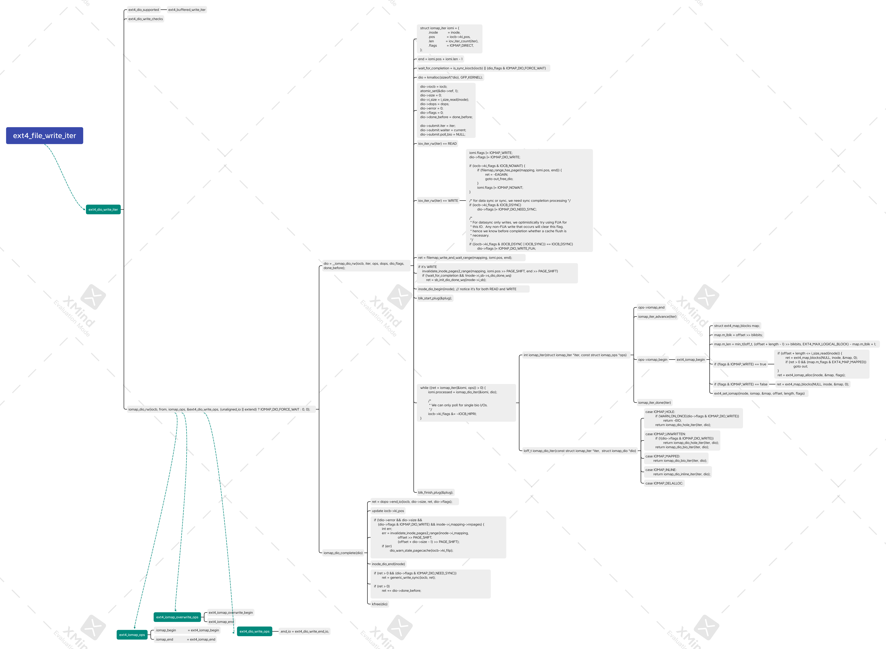
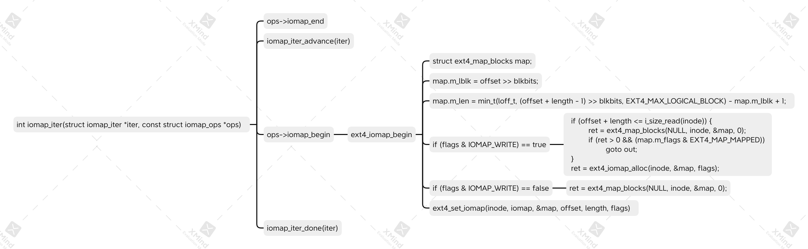

# IOMAP

iomap is an abstract layer to do the (file logical block address --> physical block address)
translation. It is friendly to extent based filesystems.

## OVERVIEW

To have a overview, we pick up ext4 dio write as an instance. Below is the big picture
of it.



Ok, I know what you re thinking, don't panic, this time we just focus on a small
part of it.
First we have to know that an IO request like write(fd, offset, buf, len) may
corresponds to multiple BIOs (in case you're not familiar with this concept, a BIO
represents an IO request to a segment of contiguous disk address). The reason is
the logical file segment [offset, offset+len) may map to multiple physical segments.

Based on the above fact, IOMAP does it in this way: iterate [offset, offset+len), once
find a mapping, generate a BIO for it, then handle the next one. The specific code is:

```c
while ((ret = iomap_iter(&iomi, ops)) > 0) {
	iomi.processed = iomap_dio_iter(&iomi, dio);

	/*
	 * We can only poll for single bio I/Os.
	 */
	iocb->ki_flags &= ~IOCB_HIPRI;
}
```

## CODE ANALYSIS

Let's dive much more deeply into it. In the above code, `iomap_iter()` takes the
iomap iterator and the iomap ops to iterator the logical segment, it returns when
a physical segment is found. And `iomap_dio_iter()`, handles the physical segment
found, it basically generate a BIO for it.

Before analyze these two functions, we should be clear about the below two data
structures.

```c
struct iomap_ops {
	/*
	 * Return the existing mapping at pos, or reserve space starting at
	 * pos for up to length, as long as we can do it as a single mapping.
	 * The actual length is returned in iomap->length.
	 */
	int (*iomap_begin)(struct inode *inode, loff_t pos, loff_t length,
			unsigned flags, struct iomap *iomap,
			struct iomap *srcmap);

	/*
	 * Commit and/or unreserve space previous allocated using iomap_begin.
	 * Written indicates the length of the successful write operation which
	 * needs to be commited, while the rest needs to be unreserved.
	 * Written might be zero if no data was written.
	 */
	int (*iomap_end)(struct inode *inode, loff_t pos, loff_t length,
			ssize_t written, unsigned flags, struct iomap *iomap);
};
```

struct iomap_ops defines how to do the logical->physical translation. In each
iteration, we call iomap_begin() to do the translation and return a single mapping.
iomap_end() is undiscovered for now...
This is implemented by the real filesystem.

```c
struct iomap {
	u64			addr; /* disk offset of mapping, bytes */
	loff_t			offset;	/* file offset of mapping, bytes */
	u64			length;	/* length of mapping, bytes */
	u16			type;	/* type of mapping */
	u16			flags;	/* flags for mapping */
	struct block_device	*bdev;	/* block device for I/O */
	struct dax_device	*dax_dev; /* dax_dev for dax operations */
	void			*inline_data;
	void			*private; /* filesystem private */
	const struct iomap_page_ops *page_ops;
};
```
Just like what I said, iomap_begin() returns a single mapping each time. And the
returned mapping is stored in struct iomap. The comments above are already very
clear, I'm not going to be verbose..., But one thing I have to mention is type,
We'll talk more about it later.

```c
/**
 * struct iomap_iter - Iterate through a range of a file
 * @inode: Set at the start of the iteration and should not change.
 * @pos: The current file position we are operating on.  It is updated by
 *	calls to iomap_iter().  Treat as read-only in the body.
 * @len: The remaining length of the file segment we're operating on.
 *	It is updated at the same time as @pos.
 * @processed: The number of bytes processed by the body in the most recent
 *	iteration, or a negative errno. 0 causes the iteration to stop.
 * @flags: Zero or more of the iomap_begin flags above.
 * @iomap: Map describing the I/O iteration
 * @srcmap: Source map for COW operations
 */
struct iomap_iter {
	struct inode *inode;
	loff_t pos;
	u64 len;
	s64 processed;
	unsigned flags;
	struct iomap iomap;
	struct iomap srcmap;
	void *private;
};
```

The comments above it explain itself well. struct iomap_iter is the iterator of iomap,
just think about iov_iter, really the same thing.

All right, do some inclusion:
 - a filesystem must deliver its iomap_ops which implements `iomap_begin()` and `iomap_end()`
   to IOMAP layer.
 - IOMAP will iterate the file range in `iomap_iter()`
 - and in each iteration it calls `iomap_begin()` to do the translation
 - and store the found mapping in `struct iomap`.
 - Then call `iomap_dio_iter()` to handle the mapping(generate a BIO).

### `int iomap_iter(struct iomap_iter *iter, const struct iomap_ops *ops)`



We can see the iomap_iter() contains:
 - iomap_ops.iomap_begin(): the main dish, we do the translation there.
 - iomap_ops.iomap_end(): do some cleaning.
 - iomap_iter_advance(): move the iterator to the next iteration
 - iomap_iter_done(): just some warnning and tracing.

You may be confused about the calling order of these functions, so did I. iomap_end()
appears first, followed by iomap_iter_advance(), I'm not sure why it is designed as
what it looks like,and I think it's not friendly for reader to follow it. Let's
do some tweak to it.

```c
__iomap_dio_rw():

	while (iter hasn't gone to end) {
		iomap_ops->iomap_begin(iter->inode, iter->pos, iter->len, iter->flags, &iter->iomap. &iter->srcmap);
		iter->processed = iomap_dio_iter(iter, dio);
		iomap_iter_done(iter);
		iomap_ops->iomap_end(iter->inode, iter->pos, iomap_length(iter), iter->processed > 0 ? iter->processed : 0, iter->flags, &iter->iomap);
		iomap_iter_advance(iter);
}
```

Looks clearer? At least to me, yes...

iomap_begin(), with no doubt, is the most important part. It does the translation
from file range to disk range. Here I wrote another article to explain it: [ext4_map_blocks](./extent.md)
in ext4 filesystem.

After iomap_begin(), we get a mapping in iter->iomap. It's time to generate a BIO.
That's what iomap_dio_iter() do. Ok, I know some smart readers may rectify me that
there can be multiple BIOs generated in iomap_dio_iter(), and I'll reply yes, exactly.
This is due to the length of disk range a BIO can represent is limited. The above
'a BIO' statement is for convenience and to reduce noise, and I'll possibly still use
that statement in the rest of this article.
TOBEDONE: iomap_dio_iter()

iomap_iter_advance(), this function updates the iterator so that we can move to
the next iteration.

```c
static inline int iomap_iter_advance(struct iomap_iter *iter)
{
	/* handle the previous iteration (if any) */
	if (iter->iomap.length) {
		if (iter->processed <= 0)
			return iter->processed;
		if (WARN_ON_ONCE(iter->processed > iomap_length(iter)))
			return -EIO;
		iter->pos += iter->processed;
		iter->len -= iter->processed;
		if (!iter->len)
			return 0;
	}

	/* clear the state for the next iteration */
	iter->processed = 0;
	memset(&iter->iomap, 0, sizeof(iter->iomap));
	memset(&iter->srcmap, 0, sizeof(iter->srcmap));
	return 1;
}
```

It does three things:
 - check `processed`, if something wrong with the previous round, stop the whole iteration
 - update the the position `iter->pos` and the left length `iter->len`. This two are used
   globally in the process so that we know where we are and what remains in the file
   range.
 - clear the state for next round. In detail, `iter->processed = 0` and `clean iter->iomap and iter->srcmap`

If you are confused by srcmap, I'm sorry for not explaining it since I'm not clear about
it for now, it seems for COW case. Let's keep it in mind, I may look into it in the future.

### type of iomap
At last, there is one thing left, the `iomap.type`. This indicates what type the
mapping is. Types are:

```c
/*
 * Types of block ranges for iomap mappings:
 */
#define IOMAP_HOLE	0	/* no blocks allocated, need allocation */
#define IOMAP_DELALLOC	1	/* delayed allocation blocks */
#define IOMAP_MAPPED	2	/* blocks allocated at @addr */
#define IOMAP_UNWRITTEN	3	/* blocks allocated at @addr in unwritten state */
#define IOMAP_INLINE	4	/* data inline in the inode */
```

TOBEDONE: explain each type of iomap


Hmmm, seems we have roughly touched most part of IOMAP layer. If you are curious about
more detail, read the code, I think you'll get what you want.(if not, ask question in
the mail list is a good way :))
