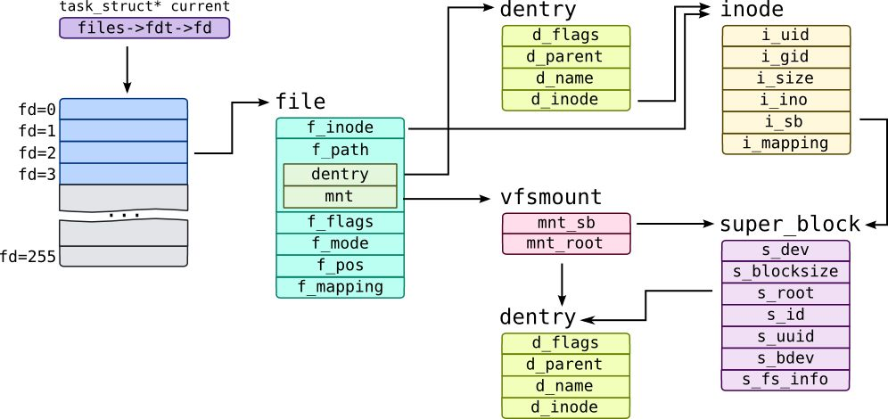

# mount

Mount is a key system call of virtual file system. It implements the tree structure of file systems in Linux system.

## data structures in vfs

Before dive deeply into the syscall, let's first have a look at the main data structures of vfs and their relationships.



If you are not familiar with dentry and inode, here is my another article about them.
[dentry and inode.md](./dentry_and_inode.md)
It is strongly recommanded to read the above article first. It makes it much easier
to understand this article. Below I'll assume that you already have the knowledge about
inode and dentry.

Before dive into the detail of code, let's look at it from a big picture. Think about it,
now you are designing the function of mount, how do you do it?

Ok, let's pick up the example we use in article dentry_and_inode.md. Given a filesystem
instance like this:

```c
                   '/'
                /   |   \
              'a' 'usr' 'var'
              / \
            'b' 'x'
            / \
          'c' 'y'
```

How do we mount another device /dev/mydev with a filesystem to /a?
We already know path walking when opening a file is actually going through a dentry tree
(and visit disk to load inode and build new dentry when necessary). How does it get to
know that /a is a mountpoint when it goes to 'a'?
Hmm, a simple way is setting a flag in dentry 'a' to tell us: "hey, watch out, I'm not
a normal dentry, I'm a mountpoint!". Yea, that's what Linux does for mount...very simple,
right? Not exactly, we have to do many dirty work, which are not big problems:
 (1) load filesystem on /dev/mydev, more specifically, the superblock.
 (2) build root dentry for filesystem on mydev. And link it to superblock.
 (3) build new struct mount structure(this stands for a mountpoint) and add it to hash table
 (4) mark the dentry of 'a' as a mountpoint dentry

Here, a lot of things to concern:
 * For (1), how do we find the device by the device name, this involves a special filesystem
   [blkdev](./blkdev.md)
 * How do we find the struct mount structure when doing open and going to a mountpoint dentry?
 * Can a filesystem instance be mounted to multiple place?
 * Can a dentry(mountpoint) be mounted multiple times at the same time? If yes, how will it work
   then?
 * Can we mount a filesystem to somewhere in itself?
   Ok this one may be a bit confused, let me explain it more. What I mean is you have /dev/mydev
   mounted on /mnt/mount1, assume there is a directory /mnt/mount1/mount2, can we mount /dev/mydev
   to /mnt/mount1/mount2 again? This one is interesting, right? At least it is for me when this
   comes to my mind. :)

Let's first have a look at the big picture(this shows a very basic case)
(again, does anyone know how to draw this kind of pure text graph easier, it's sufferring when I do
it.)

```c


                                           +-------------------------+      +-------------------------+   +-------------------------+
  +--------------------------------------->|     struct mount        |      |     struct mount        |   |     struct mount        |
  |                                        +-------------------------+      +-------------------------+   +-------------------------+
  |                                        | +---------------------+ |      | +---------------------+ |   | +---------------------+ |
  |                                        | | struct vfsmount mnt | |      | | struct vfsmount mnt | |   | | struct vfsmount mnt | |
  |                                        | +---------------------+ |      | +---------------------+ |   | +---------------------+ |
  |                                        | |       mnt_root      |-|--+   | |       mnt_root      | |   | |       mnt_root      | |
  |                  +---------------------|-|        mnt_sb       | |  |   | |        mnt_sb       | |   | |        mnt_sb       | |
  |                  |                     | +---------------------+ |  |   | +---------------------+ |   | +---------------------+ |
  |                  |                     |                         |  |   |                         |   |                         |
  |                  |             +------>|      mnt_instance       |----->|      mnt_instance       |-->|      mnt_instance       |
  |                  |             |       |                         |  |   |                         |   |                         |
  |                  |             |       +-------------------------+  |   +-------------------------+   +-------------------------+
  |                  |             |                                    |
  |                  |             |                                    |
  |                  |             |                                    |
  |                  |             |                                    |
  |                  V             |                                    |
  |    +----------------------+    |                                    |
  |    |       superblock     |    |                                    |
  |    +----------------------+    |                                    |
  |    |      s_mounts        | ---+               +--------------------+
  |    |                      |                    |
  |    |                      |                    |
  |    |                      |                    |
  |    |                      |                    |
  |    |                      |                    |
  |    |                      |                    V
  |    |                      |       +----------------------+
  |    |       s_root         | ----> |       dentry /       | <--------dh------ dentry_hashtable
  |    |       ......         |       +----------------------+
  |    +----------------------+       | d_name = {hash, ''}  |
  |         ^                         | d_parent             |
  |         |                         | d_inode = inode_/(2) |
  |         |                         | d_sb                 |
  |         |                         | d_child              |
  |         |    +------------------- | d_subdirs            |
  |         |    |                    +----------------------+
  |         |    |                               |
  |         |    |                      +---dh---+
  |         |    |                      V
  |         |    |         +--------------------------+    +------------------------+     +------------------------+
  |         |    |         |       dentry a           |-dh>|       dentry usr       | --> |       dentry var       | ---+
  |         |    |         +--------------------------+    +------------------------+     +------------------------+    |
  |         |    |         | d_name = {hash, 'a'}     |    | d_name = {hash, 'usr'} |     | d_name = {hash, 'var'} |    |
  |         |    |         | d_parent = dentry /      |    | d_parent = dentry /    |     | d_parent = dentry /    |    |
  |         |    |         | d_inode = inode_a        |    | d_inode = inode_usr    |     | d_inode = inode_var    |    |
  |         +------------- | d_sb                     |    | d_sb                   |     | d_sb                   |    d
  |              +-------> | d_child                  |--> | d_child                | --> | d_child                |    h
  |                        | d_subdirs                |-+  | d_subdirs              |     | d_subdirs              |    |
  |                        | d_flags |= DCACHE_MOUNTED| |  +------------------------+     +------------------------+    |
  |                        +--------------------------+ |                                                               |
  |                                  ^                  |                                                               |
  |                                  |                  |                                                               |
  |                                  |                  |  +----------------------+       +----------------------+      |
  |                                  |          +--------- |       dentry b       | <-dh- |       dentry x       | <----+
  |                                  |          |       |  +----------------------+       +----------------------+
  |                                  |          |       |  | d_name = {hash, 'b'} |       | d_name = {hash, 'x'} |
  |                                  |          |       |  | d_parent = dentry a  |       | d_parent = dentry a  |
  |                                  |          |       |  | d_inode = inode_b    |       | d_inode = inode_x    |
  |                                  |          |       |  | d_sb                 |       | d_sb                 |
  |                                  |          |       +->| d_child              | ----> | d_child              |
  |                                  |          |          | d_subdirs            | --+   | d_subdirs            |
  |                                  |          |          +----------------------+   |   +----------------------+
  |                                  |          |                                     |
  |                                  |          |                                     |
  |                                  |          |                                     |     +----------------------+         +----------------------+
  |                                  |          +-------------------dh--------------------> |       dentry c       | --dh--> |       dentry y       |
  |                                  |                                                |     +----------------------+         +----------------------+
  |                                  |                                                |     | d_name = {hash, 'c'} |         | d_name = {hash, 'y'} |
  |                                  |                                                |     | d_parent = dentry b  |         | d_parent = dentry b  |
  |                                  |                                                |     | d_inode = inode_c    |         | d_inode = inode_y    |
  |                                  |                                                |     | d_sb                 |         | d_sb                 |
  |                                  |                                                +---> | d_child              |  ---->  | d_child              |
  |                                  |                                                      | d_subdirs            |         | d_subdirs            |
  |                                  |                                                      +----------------------+         +----------------------+
  |                                  |
  |                                  |
  |                                  |
  |                                  |
  |                                  |
  |                                  |
  |                                  |
  |                                  |    +-------------------------+
  |                                  |    |     struct mount        |
  |                                  |    +-------------------------+
  |                                  |    | +---------------------+ |
  |                                  |    | | struct vfsmount mnt | |
  |                                  |    | +---------------------+ |
  |                                  |    | |       mnt_root      |-|--+
  |                 +---------------------|-|        mnt_sb       | |  |
  |                 |                |    | +---------------------+ |  |
  |                 |                |    |                         |  |
  |                 |             +------>|      mnt_instance       |  |
  |                 |             |  |    |                         |  |
  |                 |             |  +----|       mnt_mountpoint    |  |
  |                 |             |       |                         |  |
  +---------------------------------------|       mnt_parent        |  |
                    |             |       |                         |  |
                    |             |       +-------------------------+  |
                    |             |                                    |
                    |             |                                    |
                    V             |                                    |
      +----------------------+    |                                    |
      |       superblock     |    |                                    |
      +----------------------+    |                                    |
      |      s_mounts        | ---+               +--------------------+
      |                      |                    |
      |                      |                    |
      |                      |                    |
      |                      |                    |
      |                      |                    |
      |                      |                    V
      |                      |       +----------------------+
      |       s_root         | ----> |       dentry /       |
      |       s_bdev         |       +----------------------+
      +----------------------+       | d_name = {hash, ''}  |
                                     | d_parent             |
                                     | d_inode = inode_/    |
                                     | d_sb                 |
                                     | d_child              |
                                     | d_subdirs            |
                                     +----------------------+

```

## code analysis

### entry point

```c
SYSCALL_DEFINE5(mount, char __user *, dev_name, char __user *, dir_name,
		char __user *, type, unsigned long, flags, void __user *, data)
{
	int ret;
	char *kernel_type;
	char *kernel_dev;
	void *options;

	kernel_type = copy_mount_string(type);
	ret = PTR_ERR(kernel_type);
	if (IS_ERR(kernel_type))
		goto out_type;

	kernel_dev = copy_mount_string(dev_name);
	ret = PTR_ERR(kernel_dev);
	if (IS_ERR(kernel_dev))
		goto out_dev;

	options = copy_mount_options(data);
	ret = PTR_ERR(options);
	if (IS_ERR(options))
		goto out_data;

	ret = do_mount(kernel_dev, dir_name, kernel_type, flags, options);

	kfree(options);
out_data:
	kfree(kernel_dev);
out_dev:
	kfree(kernel_type);
out_type:
	return ret;
}

```

It's very simple, the main thing in there is copy the device string and fs type string
to kernel space. And then call do_mount().

```c
long do_mount(const char *dev_name, const char __user *dir_name,
		const char *type_page, unsigned long flags, void *data_page)
{
	struct path path;
	int ret;

	ret = user_path_at(AT_FDCWD, dir_name, LOOKUP_FOLLOW, &path);
	if (ret)
		return ret;
	ret = path_mount(dev_name, &path, type_page, flags, data_page);
	path_put(&path);
	return ret;
}

```

user_path_at() is to get the path object by dir_name.

```c
struct path {
	struct vfsmount *mnt;
	struct dentry *dentry;
} __randomize_layout;

```

The detail in it is complicated, it involves a very important part of vfs----the path walk.
This deserves a seperate article: [](./open.md)

path_mount() calls do_new_mount() to do the work.

```c
/*
 * create a new mount for userspace and request it to be added into the
 * namespace's tree
 */
static int do_new_mount(struct path *path, const char *fstype, int sb_flags,
			int mnt_flags, const char *name, void *data)
{
	struct file_system_type *type;
	struct fs_context *fc;
	const char *subtype = NULL;
	int err = 0;

	if (!fstype)
		return -EINVAL;

	// get the struct file_system_type from global file_system list
	type = get_fs_type(fstype);
	if (!type)
		return -ENODEV;

	if (type->fs_flags & FS_HAS_SUBTYPE) {
		subtype = strchr(fstype, '.');
		if (subtype) {
			subtype++;
			if (!*subtype) {
				put_filesystem(type);
				return -EINVAL;
			}
		}
	}

	fc = fs_context_for_mount(type, sb_flags);
	put_filesystem(type);
	if (IS_ERR(fc))
		return PTR_ERR(fc);

	if (subtype)
		err = vfs_parse_fs_string(fc, "subtype",
					  subtype, strlen(subtype));
	if (!err && name)
		err = vfs_parse_fs_string(fc, "source", name, strlen(name));
	if (!err)
		err = parse_monolithic_mount_data(fc, data);
	if (!err && !mount_capable(fc))
		err = -EPERM;
	if (!err)
		err = vfs_get_tree(fc);
	if (!err)
		err = do_new_mount_fc(fc, path, mnt_flags);

	put_fs_context(fc);
	return err;
}
```

1. All the filesystem drivers are linked in a global list called file_systems.
Find the specific fs, that's what get_fs_type(fstype) does.

2. `fs_context_for_mount`
This creates the struct fs_context, which is used during mount
fs_context_for_mount calls `alloc_fs_context(fs_type, NULL, sb_flags, 0, FS_CONTEXT_FOR_MOUNT);` which finally calls `fc->fs_type->init_fs_context`.
Let's pick up ext4 as an example.

```c
int ext4_init_fs_context(struct fs_context *fc)
{
	struct ext4_fs_context *ctx;

	ctx = kzalloc(sizeof(struct ext4_fs_context), GFP_KERNEL);
	if (!ctx)
		return -ENOMEM;

	fc->fs_private = ctx;
	fc->ops = &ext4_context_ops;

	return 0;
}
```
 * allocate struct fs specific context
 * assign fs_private and ops, here notice ext4_context_ops, we'll meet it later

```c
static const struct fs_context_operations ext4_context_ops = {
	.parse_param	= ext4_parse_param,
	.get_tree	= ext4_get_tree,
	.reconfigure	= ext4_reconfigure,
	.free		= ext4_fc_free,
};
```

3. `vfs_parse_fs_string(fc, "source", name, strlen(name));`
Store device name in fc->source

4.`vfs_get_tree(fc)`
get the root dentry and store it in fc->root, in this process, superblock will be
created and assigned to this dentry.

```c
int vfs_get_tree(struct fs_context *fc)
{
	struct super_block *sb;
	int error;

	if (fc->root)
		return -EBUSY;

	/* Get the mountable root in fc->root, with a ref on the root and a ref
	 * on the superblock.
	 */
	error = fc->ops->get_tree(fc);
	if (error < 0)
		return error;

	if (!fc->root) {
		pr_err("Filesystem %s get_tree() didn't set fc->root\n",
		       fc->fs_type->name);
		/* We don't know what the locking state of the superblock is -
		 * if there is a superblock.
		 */
		BUG();
	}

	sb = fc->root->d_sb;
	WARN_ON(!sb->s_bdi);

	/*
	 * Write barrier is for super_cache_count(). We place it before setting
	 * SB_BORN as the data dependency between the two functions is the
	 * superblock structure contents that we just set up, not the SB_BORN
	 * flag.
	 */
	smp_wmb();
	sb->s_flags |= SB_BORN;

	return 0;
}
```
Let's pick up ext4 again, as discussed above, we know fc->ops->get__tree is
ext4_get_tree, which simply calls get_tree_bdev(fc, ext4_fill_super);

```c
/**
 * get_tree_bdev - Get a superblock based on a single block device
 * @fc: The filesystem context holding the parameters
 * @fill_super: Helper to initialise a new superblock
 */
int get_tree_bdev(struct fs_context *fc,
		int (*fill_super)(struct super_block *,
				  struct fs_context *))
{
	struct block_device *bdev;
	struct super_block *s;
	fmode_t mode = FMODE_READ | FMODE_EXCL;
	int error = 0;

	if (!(fc->sb_flags & SB_RDONLY))
		mode |= FMODE_WRITE;

	if (!fc->source)
		return invalf(fc, "No source specified");

	bdev = blkdev_get_by_path(fc->source, mode, fc->fs_type);
	if (IS_ERR(bdev)) {
		errorf(fc, "%s: Can't open blockdev", fc->source);
		return PTR_ERR(bdev);
	}

	/* Once the superblock is inserted into the list by sget_fc(), s_umount
	 * will protect the lockfs code from trying to start a snapshot while
	 * we are mounting
	 */
	mutex_lock(&bdev->bd_fsfreeze_mutex);
	if (bdev->bd_fsfreeze_count > 0) {
		mutex_unlock(&bdev->bd_fsfreeze_mutex);
		warnf(fc, "%pg: Can't mount, blockdev is frozen", bdev);
		blkdev_put(bdev, mode);
		return -EBUSY;
	}

	fc->sb_flags |= SB_NOSEC;
	fc->sget_key = bdev;
	s = sget_fc(fc, test_bdev_super_fc, set_bdev_super_fc);
	mutex_unlock(&bdev->bd_fsfreeze_mutex);
	if (IS_ERR(s)) {
		blkdev_put(bdev, mode);
		return PTR_ERR(s);
	}

	if (s->s_root) {
		/* Don't summarily change the RO/RW state. */
		if ((fc->sb_flags ^ s->s_flags) & SB_RDONLY) {
			warnf(fc, "%pg: Can't mount, would change RO state", bdev);
			deactivate_locked_super(s);
			blkdev_put(bdev, mode);
			return -EBUSY;
		}

		/*
		 * s_umount nests inside open_mutex during
		 * __invalidate_device().  blkdev_put() acquires
		 * open_mutex and can't be called under s_umount.  Drop
		 * s_umount temporarily.  This is safe as we're
		 * holding an active reference.
		 */
		up_write(&s->s_umount);
		blkdev_put(bdev, mode);
		down_write(&s->s_umount);
	} else {
		s->s_mode = mode;
		snprintf(s->s_id, sizeof(s->s_id), "%pg", bdev);
		sb_set_blocksize(s, block_size(bdev));
		error = fill_super(s, fc);
		if (error) {
			deactivate_locked_super(s);
			return error;
		}

		s->s_flags |= SB_ACTIVE;
		bdev->bd_super = s;
	}

	BUG_ON(fc->root);
	fc->root = dget(s->s_root);
	return 0;
}
```


