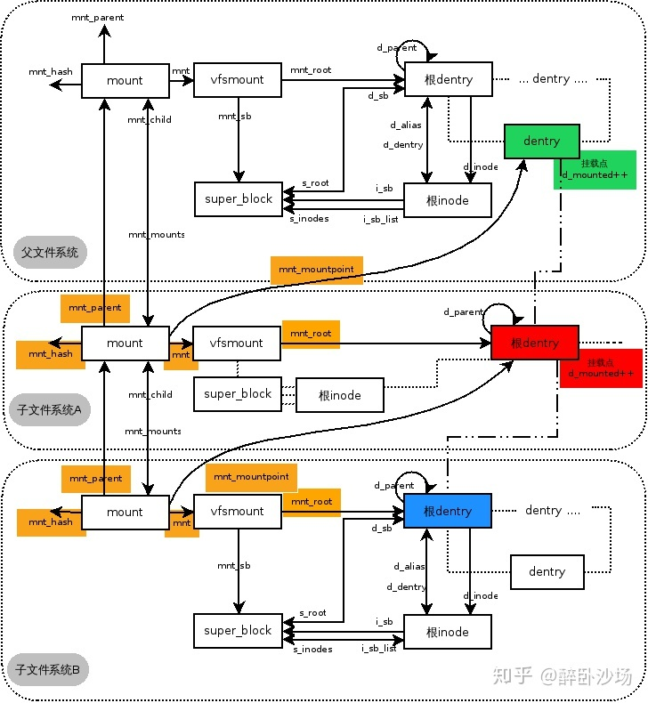

# Open

Open is one of the most important syscalls for filesystem. It is to open a file
for later use. Looks pretty simple and straightforward, right? But it's a little
bit complex if looking at it deeperly. Today let's dive into the detail code of it.

## syscall prototype

```c
       int open(const char *pathname, int flags);
       int open(const char *pathname, int flags, mode_t mode);

```

From the interface you can see clearly it opens file by the file path, plus some
flags and an optional mode argument. More details about flags and mode, please
refer to the man page.

## function call graph

- open(filename, flags, mode)
	- do_sys_open(AT_FDCWD, filename, flags, mode)
		- struct open_how how = build_open_how(flags, mode)
		- do_sys_openat2(dfd, filename, &how)
			- int fd = build_open_flags(how, &op)
			- struct filename *tmp = getname(filename)
			- fd = get_unused_fd_flags(how->flags)
			- struct file *f = do_filp_open(dfd, tmp, &op)
				- struct nameidata nd
				- int flags = op->lookup_flags
				- set_nameidata(p = &nd, dfd, name = pathname, root = NULL)
					```c
					{
						old = current->nameidata;
						p->depth = 0;
						p->dfd = dfd;
						p->name = name;
						p->path.mnt = NULL;
						p->path.dentry = NULL;
						p->total_link_count = old ? old->total_link_count : 0;
						p->saved = old;
						current->nameidata = p;

						p->state = 0;
						if (root) {
							p->state = ND_ROOT_PRESET;
							p->root = *root;
						}
					}
					```
				- struct file *filp = path_openat(&nd, op, flags = flags | LOOKUP_RCU)
					```c
					{
						struct file *file;
						const char *s = path_init(nd, flags);
						while (!(error = link_path_walk(s, nd)) &&
							(s = open_last_lookups(nd, file, op)) != NULL)
							;
						if (!error)
							error = do_open(nd, file, op);
						terminate_walk(nd);

						return file;
					}
					```
					- path_init(nd, flags)
						```c
						{
							const char *s = nd->name->name;
							nd->flags = flags;
							nd->state |= ND_JUMPED;
							if (nd->state * ND_ROOT_PRESET) {
								......
							}
							nd->root.mnt = NULL;

							/* Absolute pathname -- fetch the root (LOOKUP_IN_ROOT uses nd->dfd). */
							if (*s == '/' && !(flags & LOOKUP_IN_ROOT)) {
								error = nd_jump_root(nd);
								return s;
							}

							if (nd->dfd == AT_FDCWD) {
								nd->path = current->fs->pwd;
								nd->inode = nd->path.dentry->d_inode;

							} else {
								struct fd f = fdget_raw(nd->dfd);
								// d_can_lookup(dentry)	checks DCACHE_DIRECTORY_TYPE
								if (*s && !d_can_lookup(f.file->f_path.dentry))
									return -ENOTDIR;
								nd->path = f.file->f_path;
								nd->inode = nd->path.dentry->d_inode;
							}
							// LOOKUP_IS_SCOPED = LOOKUP_BENEATH | LOOKUP_IN_ROOT
							if (flags & LOOKUP_IS_SCOPED) {
								nd->root = nd->path;
							}

							return s;
						}
						```
						
						It sets up nd->root, nd->path, nd->inode based on the pathname (absolute or cwd relative or dfd relative).
						For LOOKUP_BENEATH and LOOKUP_IN_ROOT, we have to set the nd->root to the 'beginning dir'(original root or cwd or dirfd argument)
						These 3 variables indicate the current position we are in the fs tree when doing the path walking.
						- nd_jump_root(nd)
							- set_root(nd)
								```c
									nd->root = current->fs->root
								```
							- nd->path = nd->root;
							- nd->inode = nd->path.dentry->d_inode;

					- link_path_walk(s, nd)
						This one is the essencial one, which does path walking and handle all the non-last_components.
						
						```c
							int depth = 0;
							nd->last_type = LAST_ROOT;
							// this flag means we haven't reached the last component
							nd->flags |= LOOKUP_PARENT;

							// remove the beginning '/'
							while (*name == '/') name++;
							// return 0 if we reach the end of path
							if (!*name) { nd->dir_mode = 0; return 0; }

							for(;;) {
								/*
								 * not sure but I think this does two things
								 * 1. calculate hash based on parent dentry pointer and the component name string
								 * 2. get the component string length and store it in hash_len
								 */
								u64 hash_len = hash_name(nd->path.dentry, name);
								type = LAST_NORM;
								if it is:
									'..' ==> type = LAST_DOTDOT; nd->state |= ND_JUMPED;break for loop;
									'.' ==> type = LAST_DOT;
								
								if (type == LAST_NORM) {
									/*
									 * if fs' dentry has its own hash function, re-hash with dentry->d_op->d_hash.
									 * qstr: quick string is useful, contains the hash value and the component string.
									 */
									if (parent->d_flags & DCACHE_OP_HASH) {
										struct qstr this = { { .hash_len = hash_len }, .name = name };
										parent->d_op->d_hash(parent, &this);
									}
								}

								// update the last stuff
								nd->last.hash_len = hash_len;
								nd->last.name = name;
								nd->last_type = type;

								// move to the end of the component
								name += hashlen_len(hash_len);

								// remove the tail '/'
								do {
									name++;
								} while (*name == '/')
								// if this is the last component
								if (!*name) {
									// pathname or trailing symlink, done
									if (!depth) {
										nd->dir_vfsuid = i_uid_into_vfsuid(idmap, nd->inode);
										nd->dir_mode = nd->inode->i_mode;
										// remove this flag since we reach the end of path.
										nd->flags &= ~LOOKUP_PARENT;
										return 0;
									}
									// depth > 0 means we are in middle of handling symlink
									// we just completed one, let's go back to the previous
									// symlink.
									// it's just like dfs algorithm. 
									name = nd->stack[--depth].name;
									link = walk_component(nd, 0);
								} else {
									// not the last component
									link = walk_component(nd, WALK_MORE);
								}

								if (unlikely(link)) {
									nd->stack[depth++].name = name;
									name = link;
									continue;

								}

							}

						```

						I've already added some comments in the code, as a result, it's clear that link_path_walk() handles all the 'non-last_component'. every step it first identifies a component string and step into it by update namei_data members(inode, path .etc) to it. Finding the dentry and inode of the component from parent dentry is done by walk_component(), which will be jumped into later.

						Here comes a important question: **why there is a infinite for loop?**
						The reason is symbol link. A pathname may contain symlinks recursively.
						How to understand it? Allow me pick up an example to explain it:
						Say we have a pathname '/a/b/c', and 'b' is a symlink stands for 'e/f/g', and 'f' is also a symlink stands for '/h/i'.
						Then the structure of the pathname is actually like this
						```
							/ --> a --> b --> c
							            |
										e --> f --> g
										      |
											  h --> i
						```
						when we go to 'b', we have to first switch the state to 'e/f/g' then continue the lookup. What's more we have to return back to the previous state so that we can continue to go to 'c' after we finish 'e/f/g'.
						**A simple solution is to use depth first traversal, but it's better to use the non-recursive implementation since we are writing kernel code which is efficiency-sensitive.** That's exactly what the variable `depth` and `nd->stack[]` for.
						Ok, I know curious reader may ask a follow-up question: **What happens if the symlink is an absolute path like '/e/f/g'?**
						Good question, **it affects the update of the state in `nd`, if this happens, we have to update nd->root and related stuff.**

						**Another thing worth to mention is link_path_walk() don't handle the trail symlink, so the last component after this function returns can be a simple component or a symlink**

						- walk_component(nd, 0/WALK_MORE)
							Update the `namei_data` members `nd->path` and `nd->inode`.

							```c
								dentry = lookup_fast(nd);
								if (unlikely(!dentry))
									dentry = lookup_slow(&nd->last, nd->path.dentry, nd->flags);
								
								return step_into(nd, flags, dentry);
							```

							- lookup_fast(nd)
								This is to search the dentry from the `dcache`(dentry hash table).

							- lookup_slow(qstr = &nd->last, dir = nd->path.dentry, flags = nd->flags)
								
								```c
									// alloc dentry
									dentry = d_alloc_parallel(dir, name, &wq);

									// call fs dir_inode->lookup()
									inode = dir->d_inode;
									old = inode->i_op->lookup(inode, dentry, flags);
									if (unlikely(old)) {
										dentry = old;
									}
								```

								**It's called lookup_slow because we cannot find it in dcache, so we turn to the filesystem on disk, load the directory content and then fill the dentry with corresponding data.**

							- step_into(nd, flags, dentry)
								Now we get the dentry of the component, let's update `nd->path` and `nd->inode`, before this, this function handles mount point by `handle_mounts(nd, dentry, &path)`, time to analysis of it isn't now, but soon.

						Finally, we finish the anaalysis of `link_path_walk()`, sort of...because we haven't touch the lock stuff, mount point stuff .etc

					- open_last_lookups(nd, file, op)
						It handles the last component, the way doing it is just like the `link_path_walk()`, first look up dcache, then look up from disk by d_op->lookup(), at last call step_into() to update the `nd`.

					- do_open(nd, file, op)
						This does the last step of `open`. **[TODO]**
					- terminate_walk(nd)
						Some cleaning work, most related with symlinks

					**A question at last: why there is a while loop in path_openat()**
					```c
							while (!(error = link_path_walk(s, nd)) &&
							(s = open_last_lookups(nd, file, op)) != NULL)
							;

					```
					**Fine, I have to admit that I don't have a answer for now, but I believe there are many cases leading to re-do link_path_walk() (actually not 'redo' because we hold the walking state), I may look into it later :)**
				- restore_nameidata()

				**notice: the d_op->revalidate() stuff is for 'weak-sync' filesystem, like NFS, please refer to the kernel documentation [pathname lookup](https://www.kernel.org/doc/html/latest/filesystems/path-lookup.html) for more detail**

			- fsnotify_open(f)
				**[TODO]**
			- fd_install(fd, f)
				Install the file to file descriptor table of the process.

## mount points

How does Linux vfs handle mount points? In the previous section, we have a big picture of function calls of `open`,
but there is one thing left, each time we walk to a component, we can `step_into()` to update the `nd` state. But
the first thing in `step_into()` is actually `handle_mounts()`, because if the current dentry is a mount point, we
have to step to the root dentry of that mounted filesystem before updating the `nd` stuff.

```c
static const char *step_into(struct nameidata *nd, int flags,
		     struct dentry *dentry)
{
	struct path path;
	struct inode *inode;
	int err = handle_mounts(nd, dentry, &path);

	...
	...
}

```

We first declare a `struct path` as the return info of `handle_mounts()`.

```c
static inline int handle_mounts(struct nameidata *nd, struct dentry *dentry,
			  struct path *path)
{
	bool jumped;
	int ret;

	path->mnt = nd->path.mnt;
	path->dentry = dentry;
	if (nd->flags & LOOKUP_RCU) {
		unsigned int seq = nd->next_seq;
		if (likely(__follow_mount_rcu(nd, path)))
			return 0;
		// *path and nd->next_seq might've been clobbered
		path->mnt = nd->path.mnt;
		path->dentry = dentry;
		nd->next_seq = seq;
		if (!try_to_unlazy_next(nd, dentry))
			return -ECHILD;
	}
	ret = traverse_mounts(path, &jumped, &nd->total_link_count, nd->flags);
	if (jumped) {
		if (unlikely(nd->flags & LOOKUP_NO_XDEV))
			ret = -EXDEV;
		else
			nd->state |= ND_JUMPED;
	}
	if (unlikely(ret)) {
		dput(path->dentry);
		if (path->mnt != nd->path.mnt)
			mntput(path->mnt);
	}
	return ret;
}

```

### `handle_mounts()` does this:

- update `path->mnt` and `path->dentry` to the current `nd->path.mnt` and `dentry`
- do rcu mount point lookup if we are in rcu lookup stage.
- normal ref lookup with `traverse_mounts()`

#### Let's look into the rcu lookup:

```c
static bool __follow_mount_rcu(struct nameidata *nd, struct path *path)
{
	struct dentry *dentry = path->dentry;
	unsigned int flags = dentry->d_flags;

	if (likely(!(flags & DCACHE_MANAGED_DENTRY)))
		return true;

	if (unlikely(nd->flags & LOOKUP_NO_XDEV))
		return false;

	for (;;) {
		/*
		 * Don't forget we might have a non-mountpoint managed dentry
		 * that wants to block transit.
		 */
		if (unlikely(flags & DCACHE_MANAGE_TRANSIT)) {
			int res = dentry->d_op->d_manage(path, true);
			if (res)
				return res == -EISDIR;
			flags = dentry->d_flags;
		}

		if (flags & DCACHE_MOUNTED) {
			struct mount *mounted = __lookup_mnt(path->mnt, dentry);
			if (mounted) {
				path->mnt = &mounted->mnt;
				dentry = path->dentry = mounted->mnt.mnt_root;
				nd->state |= ND_JUMPED;
				nd->next_seq = read_seqcount_begin(&dentry->d_seq);
				flags = dentry->d_flags;
				// makes sure that non-RCU pathwalk could reach
				// this state.
				if (read_seqretry(&mount_lock, nd->m_seq))
					return false;
				continue;
			}
			if (read_seqretry(&mount_lock, nd->m_seq))
				return false;
		}
		return !(flags & DCACHE_NEED_AUTOMOUNT);
	}
}
```

 - 1. First if it's an normal dentry (not `DCACHE_MANAGED_DENTRY` one), just return true to
tell the caller we have done the work.

```c
#define DCACHE_MANAGED_DENTRY \
	(DCACHE_MOUNTED|DCACHE_NEED_AUTOMOUNT|DCACHE_MANAGE_TRANSIT)

```

- 2. Then if it's a mount point (`DCACHE_MOUNTED`), call `struct mount *mounted = __lookup_mnt(path->mnt, dentry);`
to look up the `struct mount. (Let's ignore the `DCACHE_MANAGE_TRANSIT` for now)

```c
/*
 * find the first mount at @dentry on vfsmount @mnt.
 * call under rcu_read_lock()
 */
struct mount *__lookup_mnt(struct vfsmount *mnt, struct dentry *dentry)
{
	struct hlist_head *head = m_hash(mnt, dentry);
	struct mount *p;

	hlist_for_each_entry_rcu(p, head, mnt_hash)
		if (&p->mnt_parent->mnt == mnt && p->mnt_mountpoint == dentry)
			return p;
	return NULL;
}

```

The lookup is clear, we use **the parent mnt** and **the mounted dentry** as parameters to
get a hash value to locate the index in the global`MountCache` and then find the
target `mount` in the collision list.

```c
static inline struct hlist_head *m_hash(struct vfsmount *mnt, struct dentry *dentry)
{
	unsigned long tmp = ((unsigned long)mnt / L1_CACHE_BYTES);
	tmp += ((unsigned long)dentry / L1_CACHE_BYTES);
	tmp = tmp + (tmp >> m_hash_shift);
	return &mount_hashtable[tmp & m_hash_mask];
}
```

- 3. the return value of `__lookup_mnt()` is the found `struct mount`. And we use it
to update the `path->mnt` and `path->dentry`, **now the `path->dentry` is the root dentry
of the found filesystem**.
Are we done? No, as you can see, there is a infinite loop to do this mount lookup,
because the found dentry can also be a mount point, we have to iterate on it.

**The above case happens when you mount multiple fs to same path**
for example:

```bash
mount /dev/sda /mnt/test
mount /dev/sdb /mnt/test
```

This way the finally found dentry is the root dentry of fs on sdb, because the mount
relationship will be like this:
(Here I borrow a picture from web)




#### `traverse_mounts()`
`__follow_mount_rcu()` doesn't handle `automount` dentry. It is left to `traverse_mounts`

The first half code of it is similar with `__follow_mount_rcu()`, the different part
is it handles `DCACHE_NEED_AUTOMOUNT` case (recursively I think).

```c
static int __traverse_mounts(struct path *path, unsigned flags, bool *jumped,
			     int *count, unsigned lookup_flags)
{
	struct vfsmount *mnt = path->mnt;
	bool need_mntput = false;
	int ret = 0;

	while (flags & DCACHE_MANAGED_DENTRY) {
		...
		...
		...

		if (flags & DCACHE_MOUNTED) {	// something's mounted on it..
			struct vfsmount *mounted = lookup_mnt(path);
			if (mounted) {		// ... in our namespace
				...
				...
				...
				need_mntput = true;
				continue;
			}
		}

		if (!(flags & DCACHE_NEED_AUTOMOUNT))
			break;

		// uncovered automount point
		ret = follow_automount(path, count, lookup_flags);
		flags = smp_load_acquire(&path->dentry->d_flags);
		if (ret < 0)
			break;
	}

	...
	...
	...

	*jumped = need_mntput;
	return ret;
}

```


