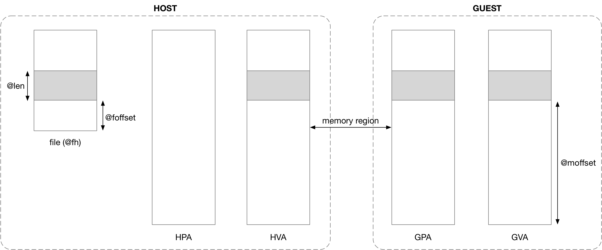

# virtiofs

## 概述
virtiofs 是由 radhat 提出的实现虚拟化环境下 guest 和 host 共享目录的框架。其总体架构如下：


使用 virtio 作为传输协议，使用 fuse 作为数据协议。也就是说，vring中的buffer数据是fuse协议的数据帧。

## FUSE
参见 [FUSE 协议](../FUSE/fuse.md)

## virtio
参见 [virtio 协议](../virtio/virtio.md)
## 前端实现
virtiofs的前端位于guest的kernel层。代码位于fs/fuse/virtio_fs.c。guest的io请求首先进入kernel的fuse layer，然后转发给virtiofs（virtio_fs.c），进而传递给对应的virtio pci driver（driver/virtio/）。virtio pci driver向vring加入请求，并通知qemu中的vhost_user_fs_pci设备。

## qemu与virtiofsd的通信
request 进入 vring 了之后qemu需要通知后端的 virtiofsd 进行处理。这是通过unix domain socket 和 eventfd实现的。
在qemu启动以及virtiofsd启动时均需要指定一个unix domain socket file, 两者通过该socket进行初始化沟通。包括：

 - qemu向virtiofsd传递用于消息通知的eventfd。
 - qemu向virtiofsd传递vring的内存信息，方便virtiofsd进行映射。

 沟通时使用的是vhost_user协议，qemu向vrtiofsd发送一个virtqueue对应的eventfd之后virtiofsd会创建thread用于处理该virtqueue的数据。

## 后端：virtiofsd

## virtiofs DAX

virtiofs DAX是非常重要的特性，可以使guest访问文件时绕过guest pagecahe，直接访问host的pagecache。


1. Host: register memory region

qemu 创建虚拟机的过程中会执行 anonymous mmap() 分配一段虚拟地址空间。

2. HVA->GPA
qemu 会调用 KVM_SET_USER_MEMORY_REGION ioctl 将上述 anonymous mmap() 申请分配的 HVA 地址区间与 qemu 分配给 guest 的一段 GPA 地址区间相映射

3. Guest: remap DAX window

virtiofs 初始化过程中会通过 memremap 将 DAX window 对应的 GPA 映射为 GVA，这其中的逻辑主要是在 guest page table 中分配相应的 page table entry，以描述该映射关系。

4. Guest: FUSE_SETUPMAPPING

之后当 guest 向 virtiofsd 发送 FUSE_SETUPMAPPING 请求 (将 @fh 文件 @foffset 偏移处起始的 @len 长度的区间映射到 DAX window 中 @moffset 偏移处起始的区间) 的时候
```c
struct fuse_setupmapping_in {                                                        
        /* An already open handle */                                                 
        uint64_t        fh;                                                      
        /* Offset into the file to start the mapping */                          
        uint64_t        foffset;                                                     
        /* Length of mapping required */                                             
        uint64_t        len;                                                         
        /* Flags, FUSE_SETUPMAPPING_FLAG_* */                                    
        uint64_t        flags;                                                   
        /* Offset in Memory Window */                                                
        uint64_t        moffset;                                                 
};
```

5. Map file to HVA

virtiofsd 会向 qemu 发送 vhost-user 协议中的 VHOST_USER_SLAVE_FS_MAP 消息，qemu 接收到该消息时，会执行 file mmap() 操作，将这个文件映射到之前 anonymous mmap() 分配的虚拟地址区间的相应偏移处。



需要注意的是，此时 host 上可能还没有为该 file mmap 分配对应的 page frame，即 HPA 地址空间中尚未分配对应的地址区间

6. KVM: EPT violations

之后 guest 访问 DAX window 的 GVA 时，guest page table 负责 GVA -> GPA 的地址翻译，之后在 x86 架构下，处理器硬件会自动通过 Extended page table (EPT) 实现 GPA -> HPA 的翻译


对于顺序读而言，dax方式是非常高效的。但是随机访问可能会发生回退。如果访问位置超出dax window，则需要重新进行"map file to hva"。

DAX基础知识: [dax](../dax/dax.md)

## 使用

```shell
host# virtiofsd --socket-path=/var/run/vm001-vhost-fs.sock -o source=/var/lib/fs/vm001
host# qemu-system-x86_64 \
      -chardev socket,id=char0,path=/var/run/vm001-vhost-fs.sock \
      -device vhost-user-fs-pci,chardev=char0,tag=myfs \
      -object memory-backend-memfd,id=mem,size=4G,share=on \
      -numa node,memdev=mem \
      ...
guest# mount -t virtiofs myfs /mnt
```

## 性能


## Reference

[virtio-fs A shared file system for virtual machines](https://www.youtube.com/watch?v=969sXbNX01U&t=1318s)

[virtio-fs A shared file system for virtual machines](https://www.youtube.com/watch?v=EIVOzTsGMMI&t=329s)

[virtiofs official](https://virtio-fs.gitlab.io/)

[virtiofs per-file dax](https://lwn.net/Articles/872521/)
